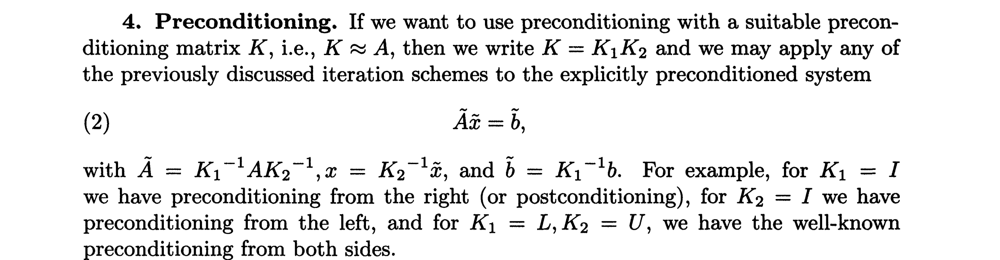
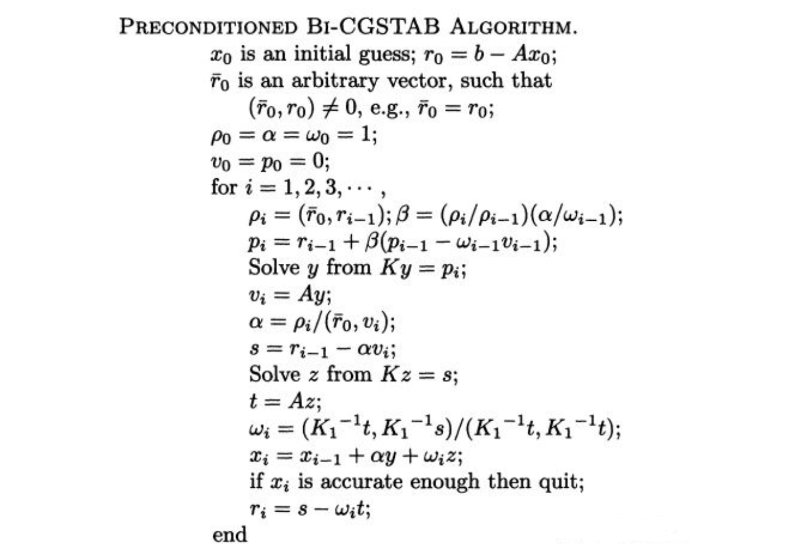

# 稳定双共轭梯度法

# 稳定双共轭梯度法

`Bi-CGSTAB: A fast and smoothly converging variant of BI-CG for the solution of nonsymetric linear systems[]`

双共轭梯度法(Bi-CG)是共轭梯度法(CG-S)(Conjugate Gradients-Squared)发展而来的。CG-S方法可能导致相当不规则的收敛行为，可能使舍入误差产生严重的抵消效应。稳定双共轭梯度法(Bi-CGSTAB)则似乎不受这些负面影响。

## 数学描述

[编程语言整理](https://zhuanlan.zhihu.com/p/369204956)

---

| $P$        | $V$        | $D$        | $S$        | $R$        | $R_0$      | $T$        |
| ---------- | ---------- | ---------- | ---------- | ---------- | ---------- | ---------- |
| work(off1) | work(off2) | work(off3) | work(off4) | work(off5) | work(off6) | work(off7) |
| $\dfrac{\partial u}{\partial x}$ |$\dfrac{\partial v}{\partial x}$|$\dfrac{\partial w}{\partial x}$|||||
| |||||||
| |||||||

$P(ijk)=0,V(ijk)=0,D(ijk)=0$ 

---

`计算全场最大残差`

$R(ijk)=coef(SC,ijk)\cross F(ijks)+...+coef(RC,ijk)\cross F(ijkr)$

$-coef(PC,ijk)\cross f(ijkp)+coef(BPC,ijk)$

---

$error=max(\abs{R(ijk)})$

---

`计算对角阵元素`

$\dfrac{1}{D(ijk)}=coef(PC,ijk)$

$-D(ijkw)\cross coef(WC,ijk)\cross coef(EC,ijkw)$

$-D(ijks)\cross coef(SC,ijk)\cross coef(NC,ijks)$

$-D(ijkl)\cross coef(LC,ijk)\cross coef(RC,ijkl)$

---
`Solver LOOP initalization`

$\rho=1,\alpha =1,\omega=1,S(ijk)=0$

---

---

### LOOP (NCYCLE)

$\beta=\dfrac{\frac{\alpha}{\omega}}{\rho}$

---

$\rho =\sum R_0(ijk)\cross R(ijk)$

---

$\beta=\beta\cross\rho$

---

$P(ijk)=R(ijk)+\beta\cross(P(ijk)-\omega\cross V(ijk))$

---

`下三角矩阵`

$S(ijk)=[P(ijk)+coef(WC,ijk)\cross S(ijkw)+coef(SC,ijk)\cross S(ijks)+coef(LC,ijk)\cross S(ijkl)]\cross D(ijk)$

---

`对角阵`

$S(ijk)=\dfrac{S(ijk)}{D(ijk)+small}$

---

`上三角阵`

$S(ijk)=[P(ijk)+coef(EC,ijk)\cross S(ijke)+coef(NC,ijk)\cross S(ijkn)+coef(RC,ijk)\cross S(ijkr)]\cross D(ijk)$

---

$V(ijk)=coef(PC,ijk)\cross S(ijk)$

$-coef(EC,ijk)\cross S(ijke)-coef(WC,ijk)\cross S(ijkw)$

$-coef(NC,ijk)\cross S(ijkn)-coef(SC,ijk)\cross S(ijks)$

$-coef(RC,ijk)\cross S(ijkr)-coef(LC,ijk)\cross S(ijkl)$

---

$\alpha = \dfrac{\rho}{\sum R_0(ijk)\cross V(ijk)}$

---

$F(ijkp)+=\alpha \cross S(ijk)$

$S(ijk)=R(ijk)-\alpha \cross V(ijk)$

$R(ijk)=S(ijk)$

---

`下三角阵`

$S(ijk)=[P(ijk)+coef(WC,ijk)\cross S(ijkw)+coef(SC,ijk)\cross S(ijks)+coef(LC,ijk)\cross S(ijkl)]\cross D(ijk)$

---

`对角阵`

$S(ijk)=\dfrac{S(ijk)}{D(ijk)+small}$

---

`上三角阵`

$S(ijk)=[P(ijk)+coef(EC,ijk)\cross S(ijke)+coef(NC,ijk)\cross S(ijkn)+coef(RC,ijk)\cross S(ijkr)]\cross D(ijk)$

---

$T(ijk)=coef(PC,ijk)\cross S(ijk)$

$-coef(EC,ijk)\cross S(ijke)-coef(WC,ijk)\cross S(ijkw)$

$-coef(NC,ijk)\cross S(ijkn)-coef(SC,ijk)\cross S(ijks)$

$-coef(RC,ijk)\cross S(ijkr)-coef(LC,ijk)\cross S(ijkl)$

$sum_1=\sum T(ijk)\cross R(ijk)$

$sum_2 = \sum T(ijk)\cross T(ijk)$

---

$\omega = \dfrac{sum_1}{sum_2}$

$F(ijkp)+=\omega\cross S(ijk)$

$R(ijk)-=\omega\cross T(ijk)$

---

