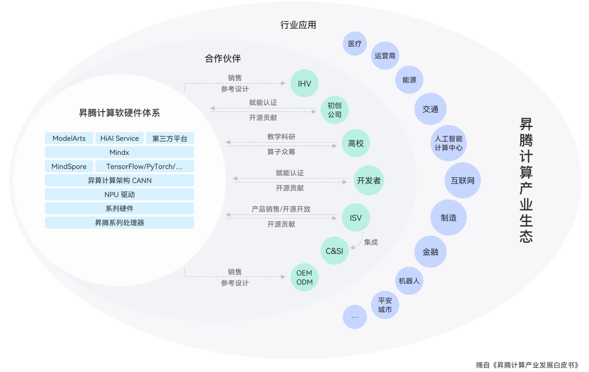
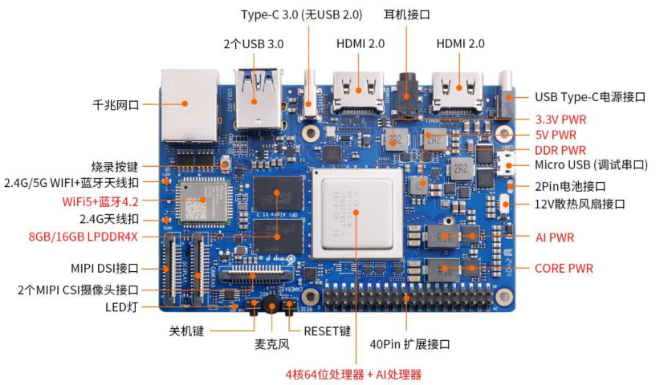
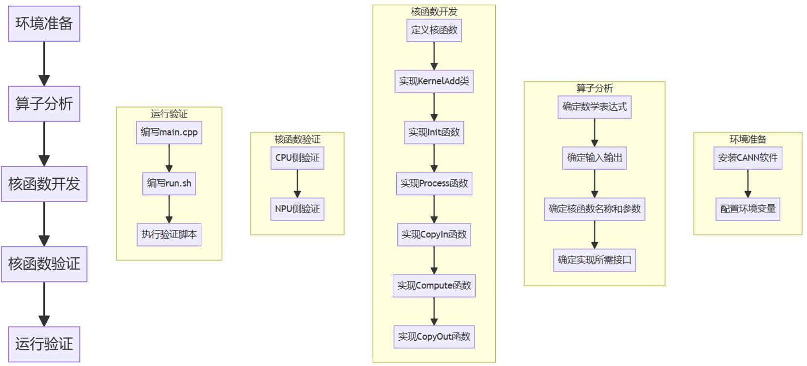

# Ascend C算子 学习笔记


# Ascend及算子开发知识整理

## 昇腾计算产业生态

#### 昇腾计算软硬件体系:

- **应用层**: 包括ModelArts、HiAI Service、Mindx等平台。
- **框架层**: 包括MindSpore、TensorFlow、PyTorch等。
- **计算架构层**: 异算计算架构CANN和NPU驱动。
- **硬件层**: 系列硬件和昇腾系列处理器。

#### 合作伙伴:

- **IHV（独立硬件供应商）**
- **高校**: 教学科研、算子众筹。
- **开发者**: 算子贡献、开源贡献。
- **ISV（独立软件供应商）**
- **OEM/ODM**: 产品销售、开源开放。

#### 行业应用:

​	广泛应用于医疗、运营商、能源、交通、互联网、制造、金融、机器人等领域。



​	昇腾计算产业以“硬件开放，软件开源，使能合作伙伴”的开放生态，推动发展。聚焦计算架构、处理器和基础软件的创新与研发，通过自有硬件和伙伴硬件相结合的方式为客户提供多样化的算力选择。昇腾计算产业发展致力于将AI新技术的红利带到世界的每个角落，让人人充分享受AI带来的美好。在AI治理上，华为与生态、商业伙伴共同倡导向善、包容、普惠和负责任的AI， 为人类社会发展带来价值。

---

## Orange Pi AI Pro

**Orange Pi AI Pro**是由香橙派与华为联合打造的一款高性能AI开发板，搭载了华为昇腾（Ascend）AI处理器，具备强大的计算能力和丰富的接口，适用于多种AI应用场景。



#### 主要特点

1. **处理器**：
   - 搭载华为Ascend 310B AI处理器，提供高达8 TOPS INT8的计算能力，适用于图像和视频分析、推理计算等任务。
2. **内存**：
   - 提供8GB和16GB LPDDR4X-3200内存版本。
3. **存储**：
   - 支持M.2 2280插槽，可扩展SATA/NVMe SSD。
   - 提供eMMC 5.1存储选项，容量从32GB到256GB不等。
   - 具有TF卡插槽。
4. **连接性**：
   - 支持Wi-Fi 5和Bluetooth 4.2。
   - 千兆以太网接口。
5. **视频输出**：
   - 两个HDMI 2.0接口，支持4K@60FPS输出。
   - 一个MIPI DSI接口。
6. **摄像头接口**：
   - 两个MIPI摄像头接口，兼容Raspberry Pi Camera模块。
7. **其他接口**：
   - 两个USB 3.0 Type-A接口。
   - 一个USB 3.0 Type-C接口。
   - 一个USB Type-C 20V电源接口。
   - 40针GPIO接口，支持GPIO、UART、I2C、SPI、I2S、PWM等。
8. **操作系统支持**：
   - 支持Ubuntu和openEuler操作系统。

#### 应用场景

- **教育**：为学生和研究人员提供一个高性能的AI开发平台。
- **机器人**：支持复杂的图像和视频处理，适用于自动导航和环境感知。
- **无人机**：提供强大的计算能力，支持实时图像处理和飞行控制。

#### 开发板规格

- 尺寸：107 x 68 mm。
- 提供丰富的外围接口，增强开发板的扩展性和适用性。

---

## 什么是算子

- **计算逻辑**: 对应网络中层或节点的计算逻辑。
- **数学含义**: 一个函数空间到另一个函数空间的映射。
- **常见举例**: tanh、ReLu、sigmoid等。

### 算子基本概念

- **算子名称**: 用于标志网络中的某个算子。
- **算子类型**: 根据算子类型实现算子的具体匹配。
- **数据容器**:
  - **Tensor**: 存储算子输入输出数据的容器，包含name、shape、dtype和format等属性。
  - **属性**: 如axis表示张量的维度。

---

## Ascend C算子

Ascend C算子采用标准C++语法和一组类库API进行编程，方便根据需求选择合适的API开发自定义算子。Ascend C算子用于高性能矩阵计算，特别适合AI运算中的矩阵计算任务。

### 术语解释

- **4核CPU**: 负责逻辑控制。
- **NPU**: 专用于计算任务。
- **HBM类显存**: 高带宽存储器，提供快速数据访问。
- **标量逻辑控制**: 控制单一数据的运算。
- **AICPU算子开发**: 在AI处理器上进行算子开发。
- **向量矩阵计算**: Ascend C支持高效的向量和矩阵运算。
- **CANN**: 使能并行加速和高效开发的框架，融合了GPU和NPU的优势，提供高效的自研算子。

### CANN优化手段

- **数据优化**: 数据融合、流水线处理和GE（Graph Engine）。
- **计算优化**: 动态Shape支持、Transformer加速库、深度融合算子。
- **通讯优化**: 数据搬移（HCCL），整图下沉，自适应梯度切分。
- **模型瘦身**: 通过AMCT工具进行模型压缩。
- **图像预处理**: 使用DVPP进行图像裁剪和归一化处理。

### 编程模型：SPMD模型

  Ascend C算子编程采用SPMD（Single-Program Multiple-Data）编程模型。SPMD是一种常用的并行计算方法，是提高计算速度的有效手段。

* **SPMD简介**

  在SPMD模型中，从输入数据到输出数据通常需要经过多个阶段的任务处理（例如，T1、T2、T3）。SPMD会启动一组进程，并行处理待处理的数据。具体来说，待处理的数据被切分成多个分片，然后分发给不同的进程，每个进程对自己的数据分片依次进行各个任务的处理。

* **Ascend C中的SPMD应用**

  在Ascend C编程模型中，待处理的数据被拆分并同时在多个计算核心（类似于多个进程）上运行，从而实现更高的性能。多个AI Core共享相同的指令代码，每个核上的运行实例唯一的区别是`block_idx`不同，每个核通过不同的`block_idx`来识别自己的身份。`block`的概念类似于进程，而`block_idx`则类似于进程ID。下面是并行计算过程的示意图：
  


  graph LR;
      subgraph Ascend C SPMD Model
      A[输入数据] -->|切分| B[数据分片1]
      A -->|切分| C[数据分片2]
      A -->|切分| D[数据分片3]
      B --> T1[任务T1] --> T2[任务T2] --> T3[任务T3] --> E[输出数据分片1]
      C --> T4[任务T1] --> T5[任务T2] --> T6[任务T3] --> F[输出数据分片2]
      D --> T7[任务T1] --> T8[任务T2] --> T9[任务T3] --> G[输出数据分片3]
      end
      E --> H[合并输出数据]
      F --> H
      G --> H



### Ascend算子的优势

- **编程语言**: 使用C/C++语言。
- **屏蔽硬件差异**: 编程模型屏蔽硬件差异。
- **类库API封装**: 提供封装好的类库API。
- **孪生调试**: 可以在CPU侧模拟NPU侧行为。

### Ascend C算子开发流程

1. **掌握Ascend C算子的核函数开发流程**。
2. **进行简单算子的分析及核函数开发**。
3. **示例**: 使用矢量计算接口进行算子开发，通常分为CopyIn、Compute和CopyOut三步。



### 核函数示例

下面的代码片段取自于Ascend C Add算子的实现代码。算子被调用时，所有的计算核心都执行相同的实现代码，入口函数的入参也是相同的。每个核上处理的数据地址需要在起始地址上增加GetBlockIdx() * BLOCK_LENGTH（每个block处理的数据长度）的偏移来获取。这样实现了多核并行计算的数据切分。

```cpp
class KernelAdd {
public:
    __aicore__ inline KernelAdd() {}
    __aicore__ inline void Init(GM_ADDR x, GM_ADDR y, GM_ADDR z)
    {
        // 获取当前核的起始索引，实现核心并行
        xGm.SetGlobalBuffer((__gm__ half*)x + BLOCK_LENGTH * GetBlockIdx(), BLOCK_LENGTH);
        yGm.SetGlobalBuffer((__gm__ half*)y + BLOCK_LENGTH * GetBlockIdx(), BLOCK_LENGTH);
        zGm.SetGlobalBuffer((__gm__ half*)z + BLOCK_LENGTH * GetBlockIdx(), BLOCK_LENGTH);
        // 初始化队列内存，单位为字节
        pipe.InitBuffer(inQueueX, BUFFER_NUM, TILE_LENGTH * sizeof(half));
        pipe.InitBuffer(inQueueY, BUFFER_NUM, TILE_LENGTH * sizeof(half));
        pipe.InitBuffer(outQueueZ, BUFFER_NUM, TILE_LENGTH * sizeof(half));
    }
    // 其他成员函数
    ...
};

// 实现核函数
extern "C" __global__ __aicore__ void add_custom(GM_ADDR x, GM_ADDR y, GM_ADDR z)
{
    // 初始化算子类，算子类提供算子初始化和核心处理等方法
    KernelAdd op;
    // 初始化函数，获取该核函数需要处理的输入输出地址，同时完成必要的内存初始化工作
    op.Init(x, y, z);
    // 核心处理函数，完成算子的数据搬运与计算等核心逻辑
    op.Process();
}
```

在上述代码中，每个计算核心都执行相同的add_custom函数，但由于GetBlockIdx()的不同，每个核心处理的数据片段也不同。这种方式实现了数据的并行处理，从而提高了计算效率。

### 调用核函数

```cpp
kernel_name<<<blockDim,12ctrl,stream>>>(argument list);
```

* **blockDim**: 表示在几个核上运行。

* **12ctrl**: 保留参数，暂设为固定值null。

* **stream**: 任务管理。

---

## 算子开发示例：Sinh算子

### AddCustom 目录结构

| 目录                      | 描述                                                         |
| ------------------------- | ------------------------------------------------------------ |
| `build.sh`                | 编译入口脚本                                                 |
| `cmake`                   | 算子工程编译所需脚本及公共编译文件存放目录                   |
| ├── `config.cmake`        | 配置文件                                                     |
| ├── `func.cmake`          | 功能文件                                                     |
| ├── `intf.cmake`          | 接口文件                                                     |
| ├── `makeself.cmake`      | 自我构建文件                                                 |
| ├── `util`                | 算子工程编译所需脚本及公共编译文件存放目录                   |
| `CMakeLists.txt`          | 算子工程的CMakeLists.txt                                     |
| `CMakePresets.json`       | 编译配置项                                                   |
| `framework`               | 算子插件实现文件目录，单算子模型文件的生成不依赖算子适配插件，无需关注 |
| `op_host`                 | host侧实现文件                                               |
| ├── `add_custom_tiling.h` | 算子tiling定义文件                                           |
| ├── `add_custom.cpp`      | 算子原型注册、shape推导、信息库、tiling实现等内容文件        |
| ├── `CMakeLists.txt`      | CMakeLists文件                                               |
| `op_kernel`               | kernel侧实现文件                                             |
| ├── `CMakeLists.txt`      | CMakeLists文件                                               |
| ├── `add_custom.cpp`      | 算子代码实现文件                                             |
| `scripts`                 | 自定义算子工程打包相关脚本所在目录                           |

### Sinh算子开发流程


graph TD;
    A[生成算子工程] --> B[修改配置文件]
    B --> C[实现 `op_host/sinh_custom_tiling.h`]
    C --> D[实现 `op_host/sinh_custom.cpp`]
    D --> E[实现 `op_kernel/sinh_custom.cpp`]
    E --> F[编译算子]
    F --> G[部署算子]
    G --> H[测试算子]



### Sinh算子功能

```
cpp
复制代码
sinh(x) = (exp(x) - exp(-x)) / 2.0
```

​	仅处理一个输入，获取一个输出，并且没有任何属性。可参考`samples`仓中的`AddCustom`实现进行部分修改即可或者使用`msopgen`工具生成算子工程文件。

### 算子实现流程

1. **生成算子工程**:

```bash
/usr/local/Ascend/ascend-toolkit/latest/python/site-packages/bin/msopgen gen -i SinhCustom.json -c ai_core-Ascend310B -lan cpp -out Sinh
```

2. **修改配置文件**:

   修改文件`CMakePresets.json`编译配置项中的`ASCEND_CANN_PACKAGE_PATH`为`/usr/local/Ascend/ascend-toolkit/latest`。

```json
"ASCEND_CANN_PACKAGE_PATH": {
       "type": "PATH",
       "value": "/usr/local/Ascend/ascend-toolkit/latest"
   }
```

3. **算子实现代码**:

##### `op_host/sinh_custom_tiling.h`

```cpp
#include "register/tilingdata_base.h"
   
namespace optiling {
BEGIN_TILING_DATA_DEF(SinhCustomTilingData)
     
   TILING_DATA_FIELD_DEF(uint32_t, totalLength);
   TILING_DATA_FIELD_DEF(uint32_t, tileNum);
END_TILING_DATA_DEF;
   
REGISTER_TILING_DATA_CLASS(SinhCustom, SinhCustomTilingData)
}
```

##### `op_host/sinh_custom.cpp`

```cpp
#include "sinh_custom_tiling.h"
#include "register/op_def_registry.h"


namespace optiling {
const uint32_t BLOCK_DIM = 8;
const uint32_t TILE_NUM = 8;
static ge::graphStatus TilingFunc(gert::TilingContext* context)
{
    SinhCustomTilingData tiling;
    uint32_t totalLength = context->GetInputTensor(0)->GetShapeSize();
    context->SetBlockDim(BLOCK_DIM);
    tiling.set_totalLength(totalLength);
    tiling.set_tileNum(TILE_NUM);
    tiling.SaveToBuffer(context->GetRawTilingData()->GetData(), context->GetRawTilingData()->GetCapacity());
    context->GetRawTilingData()->SetDataSize(tiling.GetDataSize());
    size_t *currentWorkspace = context->GetWorkspaceSizes(1);
    currentWorkspace[0] = 0;
    return ge::GRAPH_SUCCESS;
}
}


namespace ge {
static ge::graphStatus InferShape(gert::InferShapeContext* context)
{
    const gert::Shape* x1_shape = context->GetInputShape(0);
    gert::Shape* y_shape = context->GetOutputShape(0);
    *y_shape = *x1_shape;
    return GRAPH_SUCCESS;
}
}


namespace ops {
class SinhCustom : public OpDef {
public:
    explicit SinhCustom(const char* name) : OpDef(name)
    {
        this->Input("x")
            .ParamType(REQUIRED)
            .DataType({ge::DT_FLOAT16})
            .Format({ge::FORMAT_ND})
            .UnknownShapeFormat({ge::FORMAT_ND});
        this->Output("y")
            .ParamType(REQUIRED)
            .DataType({ge::DT_FLOAT16})
            .Format({ge::FORMAT_ND})
            .UnknownShapeFormat({ge::FORMAT_ND});

        this->SetInferShape(ge::InferShape);

        this->AICore()
            .SetTiling(optiling::TilingFunc);
        this->AICore().AddConfig("ascend310b");
    }
};

OP_ADD(SinhCustom);
}
```

##### `op_kernel/sinh_custom.cpp`

```cpp
#include "kernel_operator.h"
using namespace AscendC;

constexpr int32_t TOTAL_LENGTH = 8 * 2048;                            // total length of data
constexpr int32_t USE_CORE_NUM = 8;                                   // num of core used
constexpr int32_t BLOCK_LENGTH = TOTAL_LENGTH / USE_CORE_NUM;         // length computed of each core
constexpr int32_t TILE_NUM = 8;                                       // split data into 8 tiles for each core
constexpr int32_t BUFFER_NUM = 2;                                     // tensor num for each queue
constexpr int32_t TILE_LENGTH = BLOCK_LENGTH / TILE_NUM / BUFFER_NUM; // seperate to 2 parts, due to double buffer

class KernelSinh {
public:
    __aicore__ inline KernelSinh() {}
    __aicore__ inline void Init(GM_ADDR x,  GM_ADDR y)
    {
	// get start index for current core, core parallel
    	xGm.SetGlobalBuffer((__gm__ half*)x + BLOCK_LENGTH * GetBlockIdx(), BLOCK_LENGTH);
    	yGm.SetGlobalBuffer((__gm__ half*)y + BLOCK_LENGTH * GetBlockIdx(), BLOCK_LENGTH);
    	// pipe alloc memory to queue, the unit is Bytes
    	pipe.InitBuffer(inQueueX, BUFFER_NUM, TILE_LENGTH * sizeof(half));
    	pipe.InitBuffer(outQueueY, BUFFER_NUM, TILE_LENGTH * sizeof(half));
    }
    __aicore__ inline void Process()
    {
 	constexpr int32_t loopCount = TILE_NUM * BUFFER_NUM;
        for (int32_t i = 0; i < loopCount; i++) {
            CopyIn(i);
            Compute(i);
            CopyOut(i);
        }
    }

private:
    __aicore__ inline void CopyIn(int32_t progress)
    {
        // alloc tensor from queue memory
        LocalTensor<half> xLocal = inQueueX.AllocTensor<half>();
        // copy progress_th tile from global tensor to local tensor
        DataCopy(xLocal, xGm[progress * TILE_LENGTH], TILE_LENGTH);
        // enque input tensors to VECIN queue
        inQueueX.EnQue(xLocal);
    }
    __aicore__ inline void Compute(int32_t progress)
    {
    // deque input tensors from VECIN queue
    LocalTensor<half> xLocal = inQueueX.DeQue<half>();
    LocalTensor<half> yLocal = outQueueY.AllocTensor<half>();
    // call Add instr for computation
    
        Exp(xLocal,xLocal,TILE_LENGTH);
        Reciprocal(yLocal,xLocal,TILE_LENGTH);
        Sub(yLocal, xLocal, yLocal, TILE_LENGTH);
        half scalar = 0.5;
        Muls(yLocal,yLocal,scalar,TILE_LENGTH);
    // enque the output tensor to VECOUT queue
    outQueueY.EnQue<half>(yLocal);
    // free input tensors for reuse
    inQueueX.FreeTensor(xLocal);
    }
    __aicore__ inline void CopyOut(int32_t progress)
    {
    // deque output tensor from VECOUT queue
    LocalTensor<half> yLocal = outQueueY.DeQue<half>();
    // copy progress_th tile from local tensor to global tensor
    DataCopy(yGm[progress * TILE_LENGTH], yLocal, TILE_LENGTH);
    // free output tensor for reuse
    outQueueY.FreeTensor(yLocal);
    }

private:
    TPipe pipe;
    //create queue for input, in this case depth is equal to buffer num
    TQue<QuePosition::VECIN, BUFFER_NUM> inQueueX;
    //create queue for output, in this case depth is equal to buffer num
    TQue<QuePosition::VECOUT, BUFFER_NUM> outQueueY;
    GlobalTensor<half> xGm;
    GlobalTensor<half> yGm;

};

extern "C" __global__ __aicore__ void sinh_custom(GM_ADDR x, GM_ADDR y, GM_ADDR workspace, GM_ADDR tiling) {
    GET_TILING_DATA(tiling_data, tiling);
    KernelSinh op;

	op.Init(x,y);
	op.Process();
}
```

#### 算子编译部署

```bash
# cd进入算子工程目录内
# 编译
# chmod +x ./build.sh # 若没有执行权限，可以使用
./build.sh

# 部署
cd ./build_out
./custom_opp_ubuntu_aarch64.run
```

#### 算子测试

使用`samples`仓中`AddCustom`算子下的`AclNNInvocation`工程经过修改之后，进行测试。

##### `scripts/gen_data.py`

```python
#!/usr/bin/python3
# -*- coding:utf-8 -*-
# Copyright 2022-2023 Huawei Technologies Co., Ltd
import numpy as np

def gen_golden_data_simple():
    input_x = np.random.uniform(1, 10, [8, 2048]).astype(np.float16)
    golden = np.sinh(input_x)

    input_x.tofile("./input/input_x.bin")
    golden.tofile("./output/golden.bin")

if __name__ == "__main__":
    gen_golden_data_simple()
```

##### `src/main.cpp`

```cpp
/**
* @file main.cpp
*
* Copyright (C) 2023. Huawei Technologies Co., Ltd. All rights reserved.
*
* This program is distributed in the hope that it will be useful,
* but WITHOUT ANY WARRANTY; without even the implied warranty of
* MERCHANTABILITY or FITNESS FOR A PARTICULAR PURPOSE.
*/
#include <cstdint>
#include <iostream>
#include <unistd.h>
#include <sys/types.h>
#include <sys/stat.h>

#include "acl/acl.h"
#include "op_runner.h"

#include "common.h"

bool g_isDevice = false;
int deviceId = 0;

OperatorDesc CreateOpDesc()
{
    // define operator
    std::vector<int64_t> shape { 8, 2048 };
    aclDataType dataType = ACL_FLOAT16;
    aclFormat format = ACL_FORMAT_ND;
    OperatorDesc opDesc;
    opDesc.AddInputTensorDesc(dataType, shape.size(), shape.data(), format);
    opDesc.AddOutputTensorDesc(dataType, shape.size(), shape.data(), format);
    return opDesc;
}

bool SetInputData(OpRunner &runner)
{
    size_t fileSize = 0;
    ReadFile("../input/input_x.bin", fileSize, runner.GetInputBuffer<void>(0), runner.GetInputSize(0));
    INFO_LOG("Set input success");
    return true;
}

bool ProcessOutputData(OpRunner &runner)
{
    WriteFile("../output/output_z.bin", runner.GetOutputBuffer<void>(0), runner.GetOutputSize(0));
    INFO_LOG("Write output success");
    return true;
}

void DestoryResource()
{
    bool flag = false;
    if (aclrtResetDevice(deviceId) != ACL_SUCCESS) {
        ERROR_LOG("Reset device %d failed", deviceId);
        flag = true;
    }
    INFO_LOG("Reset Device success");
    if (aclFinalize() != ACL_SUCCESS) {
        ERROR_LOG("Finalize acl failed");
        flag = true;
    }
    if (flag) {
        ERROR_LOG("Destory resource failed");
    } else {
        INFO_LOG("Destory resource success");
    }
}

bool InitResource()
{
    std::string output = "../output";
    if (access(output.c_str(), 0) == -1) {
        int ret = mkdir(output.c_str(), 0700);
        if (ret == 0) {
            INFO_LOG("Make output directory successfully");
        }
        else {
            ERROR_LOG("Make output directory fail");
            return false;
        }
    }

    // acl.json is dump or profiling config file
    if (aclInit("../scripts/acl.json") != ACL_SUCCESS) {
        ERROR_LOG("acl init failed");
        return false;
    }

    if (aclrtSetDevice(deviceId) != ACL_SUCCESS) {
        ERROR_LOG("Set device failed. deviceId is %d", deviceId);
        (void)aclFinalize();
        return false;
    }
    INFO_LOG("Set device[%d] success", deviceId);

    // runMode is ACL_HOST which represents app is running in host
    // runMode is ACL_DEVICE which represents app is running in device
    aclrtRunMode runMode;
    if (aclrtGetRunMode(&runMode) != ACL_SUCCESS) {
        ERROR_LOG("Get run mode failed");
        DestoryResource();
        return false;
    }
    g_isDevice = (runMode == ACL_DEVICE);
    INFO_LOG("Get RunMode[%d] success", runMode);

    return true;
}

bool RunOp()
{
    // create op desc
    OperatorDesc opDesc = CreateOpDesc();

    // create Runner
    OpRunner opRunner(&opDesc);
    if (!opRunner.Init()) {
        ERROR_LOG("Init OpRunner failed");
        return false;
    }

    // Load inputs
    if (!SetInputData(opRunner)) {
        ERROR_LOG("Set input data failed");
        return false;
    }

    // Run op
    if (!opRunner.RunOp()) {
        ERROR_LOG("Run op failed");
        return false;
    }

    // process output data
    if (!ProcessOutputData(opRunner)) {
        ERROR_LOG("Process output data failed");
        return false;
    }

    INFO_LOG("Run op success");
    return true;
}

int main(int argc, char **argv)
{
    if (!InitResource()) {
        ERROR_LOG("Init resource failed");
        return FAILED;
    }
    INFO_LOG("Init resource success");

    if (!RunOp()) {
        DestoryResource();
        return FAILED;
    }

    DestoryResource();

    return SUCCESS;
}
```

##### `src/op_runner.cpp`

```cpp
/**
* @file op_runner.cpp
*
* Copyright (C) 2020. Huawei Technologies Co., Ltd. All rights reserved.
*
* This program is distributed in the hope that it will be useful,
* but WITHOUT ANY WARRANTY; without even the implied warranty of
* MERCHANTABILITY or FITNESS FOR A PARTICULAR PURPOSE.
*/
#include "op_runner.h"
#include "aclnn_sinh_custom.h"
#include <limits>
#include <cassert>
#include "acl/acl_op_compiler.h"
#include "common.h"

using namespace std;

extern bool g_isDevice;

OpRunner::OpRunner(OperatorDesc *opDesc) : opDesc_(opDesc)
{
    numInputs_ = opDesc->inputDesc.size();
    numOutputs_ = opDesc->outputDesc.size();
}

OpRunner::~OpRunner()
{
    for (size_t i = 0; i < numInputs_; ++i) {
        (void)aclDestroyTensor(inputTensor_[i]);
        (void)aclDestroyDataBuffer(inputBuffers_[i]);
        (void)aclrtFree(devInputs_[i]);
        if (g_isDevice) {
            (void)aclrtFree(hostInputs_[i]);
        } else {
            (void)aclrtFreeHost(hostInputs_[i]);
        }
    }

    for (size_t i = 0; i < numOutputs_; ++i) {
        (void)aclDestroyTensor(outputTensor_[i]);
        (void)aclDestroyDataBuffer(outputBuffers_[i]);
        (void)aclrtFree(devOutputs_[i]);
        if (g_isDevice) {
            (void)aclrtFree(hostOutputs_[i]);
        } else {
            (void)aclrtFreeHost(hostOutputs_[i]);
        }
    }
}

bool OpRunner::Init()
{
    for (size_t i = 0; i < numInputs_; ++i) {
        auto size = GetInputSize(i);
        void *devMem = nullptr;
        if (aclrtMalloc(&devMem, size, ACL_MEM_MALLOC_NORMAL_ONLY) != ACL_SUCCESS) {
            ERROR_LOG("Malloc device memory for input[%zu] failed", i);
            return false;
        }
        devInputs_.emplace_back(devMem);
        inputBuffers_.emplace_back(aclCreateDataBuffer(devMem, size));

        void *hostInput = nullptr;
        if (g_isDevice) {
            if (aclrtMalloc(&hostInput, size, ACL_MEM_MALLOC_NORMAL_ONLY) != ACL_SUCCESS) {
                ERROR_LOG("Malloc device memory for input[%zu] failed", i);
                return false;
            }
        } else {
            if (aclrtMallocHost(&hostInput, size) != ACL_SUCCESS) {
                ERROR_LOG("Malloc device memory for input[%zu] failed", i);
                return false;
            }
        }
        if (hostInput == nullptr) {
            ERROR_LOG("Malloc memory for input[%zu] failed", i);
            return false;
        }
        hostInputs_.emplace_back(hostInput);

        aclTensor *inputTensor = aclCreateTensor(GetInputShape(i).data(), GetInputNumDims(i), GetInputDataType(i),
            nullptr, 0, GetInputFormat(i), GetInputShape(i).data(), GetInputNumDims(i), devInputs_[i]);
        if (inputTensor == nullptr) {
            ERROR_LOG("Create Tensor for input[%zu] failed", i);
            return false;
        }
        inputTensor_.emplace_back(inputTensor);
    }

    for (size_t i = 0; i < numOutputs_; ++i) {
        auto size = GetOutputSize(i);
        void *devMem = nullptr;
        if (aclrtMalloc(&devMem, size, ACL_MEM_MALLOC_NORMAL_ONLY) != ACL_SUCCESS) {
            ERROR_LOG("Malloc device memory for output[%zu] failed", i);
            return false;
        }
        devOutputs_.emplace_back(devMem);
        outputBuffers_.emplace_back(aclCreateDataBuffer(devMem, size));

        void *hostOutput = nullptr;
        if (g_isDevice) {
            if (aclrtMalloc(&hostOutput, size, ACL_MEM_MALLOC_NORMAL_ONLY) != ACL_SUCCESS) {
                ERROR_LOG("Malloc device memory for output[%zu] failed", i);
                return false;
            }
        } else {
            if (aclrtMallocHost(&hostOutput, size) != ACL_SUCCESS) {
                ERROR_LOG("Malloc device memory for output[%zu] failed", i);
                return false;
            }
        }
        if (hostOutput == nullptr) {
            ERROR_LOG("Malloc host memory for output[%zu] failed", i);
            return false;
        }
        hostOutputs_.emplace_back(hostOutput);

        aclTensor *outputTensor = aclCreateTensor(GetOutputShape(i).data(), GetOutputNumDims(i), GetOutputDataType(i),
            nullptr, 0, GetOutputFormat(i), GetOutputShape(i).data(), GetOutputNumDims(i), devOutputs_[i]);
        if (outputTensor == nullptr) {
            ERROR_LOG("Create Tensor for output[%zu] failed", i);
            return false;
        }
        outputTensor_.emplace_back(outputTensor);
    }

    return true;
}

const size_t OpRunner::NumInputs()
{
    return numInputs_;
}

const size_t OpRunner::NumOutputs()
{
    return numOutputs_;
}

const size_t OpRunner::GetInputSize(size_t index) const
{
    if (index >= numInputs_) {
        ERROR_LOG("index out of range. index = %zu, numInputs = %zu", index, numInputs_);
        return 0;
    }

    return aclGetTensorDescSize(opDesc_->inputDesc[index]);
}

const size_t OpRunner::GetInputNumDims(size_t index) const
{
    if (index >= numInputs_) {
        ERROR_LOG("index out of range. index = %zu, numInputs = %zu", index, numInputs_);
        return 0;
    }

    return aclGetTensorDescNumDims(opDesc_->inputDesc[index]);
}

aclDataType OpRunner::GetInputDataType(size_t index) const
{
    if (index >= numInputs_) {
        ERROR_LOG("index out of range. index = %zu, numInputs = %zu", index, numInputs_);
        return ACL_DT_UNDEFINED;
    }

    return aclGetTensorDescType(opDesc_->inputDesc[index]);
}

aclFormat OpRunner::GetInputFormat(size_t index) const
{
    if (index >= numInputs_) {
        ERROR_LOG("index out of range. index = %zu, numInputs = %zu", index, numInputs_);
        return ACL_FORMAT_UNDEFINED;
    }

    return aclGetTensorDescFormat(opDesc_->inputDesc[index]);
}

std::vector<int64_t> OpRunner::GetInputShape(size_t index) const
{
    std::vector<int64_t> ret;
    if (index >= numInputs_) {
        ERROR_LOG("index out of range. index = %zu, numInputs = %zu", index, numInputs_);
        return ret;
    }

    auto desc = opDesc_->inputDesc[index];
    for (size_t i = 0; i < aclGetTensorDescNumDims(desc); ++i) {
        int64_t dimSize;
        if (aclGetTensorDescDimV2(desc, i, &dimSize) != ACL_SUCCESS) {
            ERROR_LOG("get dims from tensor desc failed. dims index = %zu", i);
            ret.clear();
            return ret;
        }
        ret.emplace_back(dimSize);
    }

    return ret;
}

size_t OpRunner::GetOutputSize(size_t index) const
{
    if (index >= numOutputs_) {
        ERROR_LOG("index out of range. index = %zu, numOutputs = %zu", index, numOutputs_);
        return 0;
    }

    return aclGetTensorDescSize(opDesc_->outputDesc[index]);
}

const size_t OpRunner::GetOutputNumDims(size_t index) const
{
    if (index >= numOutputs_) {
        ERROR_LOG("index out of range. index = %zu, numOutputs = %zu", index, numOutputs_);
        return 0;
    }

    return aclGetTensorDescNumDims(opDesc_->outputDesc[index]);
}

aclDataType OpRunner::GetOutputDataType(size_t index) const
{
    if (index >= numOutputs_) {
        ERROR_LOG("index out of range. index = %zu, numOutputs = %zu", index, numOutputs_);
        return ACL_DT_UNDEFINED;
    }

    return aclGetTensorDescType(opDesc_->outputDesc[index]);
}


aclFormat OpRunner::GetOutputFormat(size_t index) const
{
    if (index >= numOutputs_) {
        ERROR_LOG("index out of range. index = %zu, numOutputs = %zu", index, numOutputs_);
        return ACL_FORMAT_UNDEFINED;
    }

    return aclGetTensorDescFormat(opDesc_->outputDesc[index]);
}

std::vector<int64_t> OpRunner::GetOutputShape(size_t index) const
{
    std::vector<int64_t> ret;
    if (index >= numOutputs_) {
        ERROR_LOG("index out of range. index = %zu, numOutputs = %zu", index, numOutputs_);
        return ret;
    }

    auto desc = opDesc_->outputDesc[index];
    for (size_t i = 0; i < aclGetTensorDescNumDims(desc); ++i) {
        int64_t dimSize;
        if (aclGetTensorDescDimV2(desc, i, &dimSize) != ACL_SUCCESS) {
            ERROR_LOG("get dims from tensor desc failed. dims index = %zu", i);
            ret.clear();
            return ret;
        }
        ret.emplace_back(dimSize);
    }
    return ret;
}

size_t OpRunner::GetInputElementCount(size_t index) const
{
    if (index >= opDesc_->inputDesc.size()) {
        ERROR_LOG("index out of range. index = %zu, numInputs = %zu", index, numInputs_);
        return 0;
    }

    return aclGetTensorDescElementCount(opDesc_->inputDesc[index]);
}

size_t OpRunner::GetOutputElementCount(size_t index) const
{
    if (index >= opDesc_->outputDesc.size()) {
        ERROR_LOG("index out of range. index = %zu, numOutputs = %zu", index, numOutputs_);
        return 0;
    }

    return aclGetTensorDescElementCount(opDesc_->outputDesc[index]);
}

bool OpRunner::RunOp()
{
    for (size_t i = 0; i < numInputs_; ++i) {
        auto size = GetInputSize(i);
        aclrtMemcpyKind kind = ACL_MEMCPY_HOST_TO_DEVICE;
        if (g_isDevice) {
            kind = ACL_MEMCPY_DEVICE_TO_DEVICE;
        }
        if (aclrtMemcpy(devInputs_[i], size, hostInputs_[i], size, kind) != ACL_SUCCESS) {
            ERROR_LOG("Copy input[%zu] failed", i);
            return false;
        }
        INFO_LOG("Copy input[%zu] success", i);
    }

    aclrtStream stream = nullptr;
    if (aclrtCreateStream(&stream) != ACL_SUCCESS) {
        ERROR_LOG("Create stream failed");
        return false;
    }
    INFO_LOG("Create stream success");

    size_t workspaceSize = 0;
    aclOpExecutor *handle = nullptr;
    //添加计算workspace大小并申请内存代码
    auto ret = aclnnSinhCustomGetWorkspaceSize(inputTensor_[0], outputTensor_[0],
                                              &workspaceSize, &handle);
    if (ret != ACL_SUCCESS) {
        (void)aclrtDestroyStream(stream);
        ERROR_LOG("Get Operator Workspace failed. error code is %d", static_cast<int32_t>(ret));
        return false;
    }
   
    void *workspace = nullptr;
    if (workspaceSize != 0) {
        if (aclrtMalloc(&workspace, workspaceSize, ACL_MEM_MALLOC_NORMAL_ONLY) != ACL_SUCCESS) {
            ERROR_LOG("Malloc device memory failed");
        }
    }
    //添加执行算子代码
    if (aclnnSinhCustom(workspace, workspaceSize, handle, stream) != ACL_SUCCESS) {
        (void)aclrtDestroyStream(stream);
        ERROR_LOG("Execute Operator failed. error code is %d", static_cast<int32_t>(ret));
        return false;
    }

    ret = aclrtSynchronizeStreamWithTimeout(stream, 5000);
    if (ret != SUCCESS) {
        ERROR_LOG("Synchronize stream failed. error code is %d", static_cast<int32_t>(ret));
        (void)aclrtDestroyStream(stream);
        return false;
    }
    INFO_LOG("Synchronize stream success");

    for (size_t i = 0; i < numOutputs_; ++i) {
        auto size = GetOutputSize(i);
        aclrtMemcpyKind kind = ACL_MEMCPY_DEVICE_TO_HOST;
        if (g_isDevice) {
            kind = ACL_MEMCPY_DEVICE_TO_DEVICE;
        }
        if (aclrtMemcpy(hostOutputs_[i], size, devOutputs_[i], size, kind) != ACL_SUCCESS) {
            INFO_LOG("Copy output[%zu] success", i);
            (void)aclrtDestroyStream(stream);
            return false;
        }
        INFO_LOG("Copy output[%zu] success", i);
    }

    (void)aclrtDestroyStream(stream);
    return true;
}


template<typename T>
void DoPrintData(const T *data, size_t count, size_t elementsPerRow)
{
    assert(elementsPerRow != 0);
    for (size_t i = 0; i < count; ++i) {
        std::cout << std::setw(10) << data[i];
        if (i % elementsPerRow == elementsPerRow - 1) {
            std::cout << std::endl;
        }
    }
}

void DoPrintFp16Data(const aclFloat16 *data, size_t count, size_t elementsPerRow)
{
    assert(elementsPerRow != 0);
    for (size_t i = 0; i < count; ++i) {
        std::cout << std::setw(10) << std::setprecision(4) << aclFloat16ToFloat(data[i]);
        if (i % elementsPerRow == elementsPerRow - 1) {
            std::cout << std::endl;
        }
    }
}

void PrintData(const void *data, size_t count, aclDataType dataType, size_t elementsPerRow)
{
    if (data == nullptr) {
        ERROR_LOG("Print data failed. data is nullptr");
        return;
    }

    switch (dataType) {
        case ACL_BOOL:
            DoPrintData(reinterpret_cast<const bool *>(data), count, elementsPerRow);
            break;
        case ACL_INT8:
            DoPrintData(reinterpret_cast<const int8_t *>(data), count, elementsPerRow);
            break;
        case ACL_UINT8:
            DoPrintData(reinterpret_cast<const uint8_t *>(data), count, elementsPerRow);
            break;
        case ACL_INT16:
            DoPrintData(reinterpret_cast<const int16_t *>(data), count, elementsPerRow);
            break;
        case ACL_UINT16:
            DoPrintData(reinterpret_cast<const uint16_t *>(data), count, elementsPerRow);
            break;
        case ACL_INT32:
            DoPrintData(reinterpret_cast<const int32_t *>(data), count, elementsPerRow);
            break;
        case ACL_UINT32:
            DoPrintData(reinterpret_cast<const uint32_t *>(data), count, elementsPerRow);
            break;
        case ACL_INT64:
            DoPrintData(reinterpret_cast<const int64_t *>(data), count, elementsPerRow);
            break;
        case ACL_UINT64:
            DoPrintData(reinterpret_cast<const uint64_t *>(data), count, elementsPerRow);
            break;
        case ACL_FLOAT16:
            DoPrintFp16Data(reinterpret_cast<const aclFloat16 *>(data), count, elementsPerRow);
            break;
        case ACL_FLOAT:
            DoPrintData(reinterpret_cast<const float *>(data), count, elementsPerRow);
            break;
        case ACL_DOUBLE:
            DoPrintData(reinterpret_cast<const double *>(data), count, elementsPerRow);
            break;
        default:
            ERROR_LOG("Unsupported type: %d", dataType);
    }
}

void OpRunner::PrintInput(size_t index, size_t numElementsPerRow)
{
    if (index >= numInputs_) {
        ERROR_LOG("index out of range. index = %zu, numOutputs = %zu", index, numInputs_);
        return;
    }

    auto desc = opDesc_->inputDesc[index];
    PrintData(hostInputs_[index], GetInputElementCount(index), aclGetTensorDescType(desc), numElementsPerRow);
}

void OpRunner::PrintOutput(size_t index, size_t numElementsPerRow)
{
    if (index >= numOutputs_) {
        ERROR_LOG("index out of range. index = %zu, numOutputs = %zu", index, numOutputs_);
        return;
    }

    auto desc = opDesc_->outputDesc[index];
    PrintData(hostOutputs_[index], GetOutputElementCount(index), aclGetTensorDescType(desc), numElementsPerRow);
}
```

### 对部署的算子进行测试

```bash
bash run.sh
```

### 过程注意点

1. 在使用`msopgen`工具(`mindspore op generator`)生成算子工程时，`soc_version`要设置为`Ascend310B`，而不是`Ascend310B4`。

   ```
   bash
   复制代码
   ${INSTALL_DIR}/python/site-packages/bin/msopgen gen -i sinh.json -c ai_core-Ascend310B -lan cpp -out Sinh
   ```

   官方文档-msopgen生成自定义算子工程

2. 算子工程不要通过`cp`复制，需要使用`msopgen`根据`json`文件生成。

3. 初始化生成的算子工程，需要修改文件`CMakePresets.json`编译配置项中的`ASCEND_CANN_PACKAGE_PATH`为CANN软件包安装后的实际路径。

4. SinhCustom算子配置文件内容如下:

```json
[
    {
        "op": "SinhCustom",
        "language":"cpp",
        "input_desc": [
            {
                "name": "x",
                "param_type": "required",
                "format": [
                    "ND"
                ],
                "type": [
                    "fp16"
                ]
            }
        ],
        "output_desc": [
            {
                "name": "y",
                "param_type": "required",
                "format": [
                    "ND"
                ],
                "type": [
                    "fp16"
                ]
            }
        ]
    }
]
```

