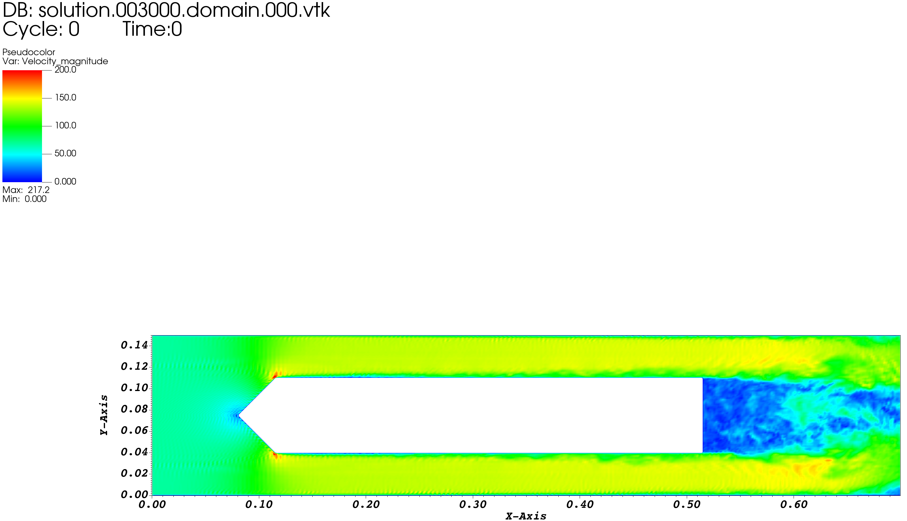
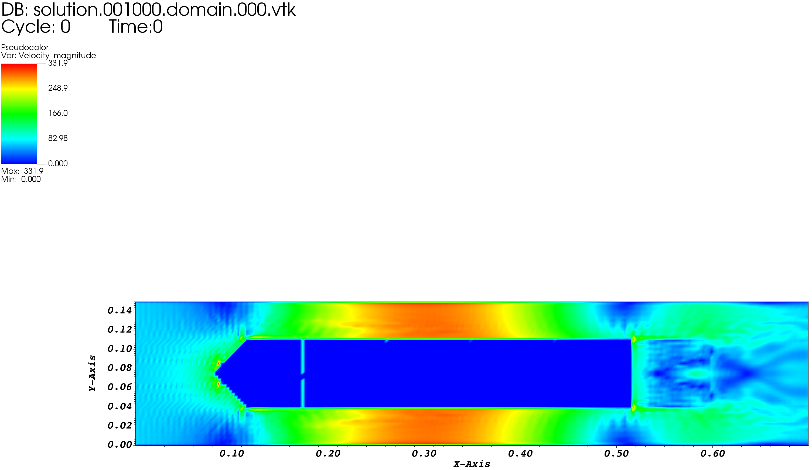
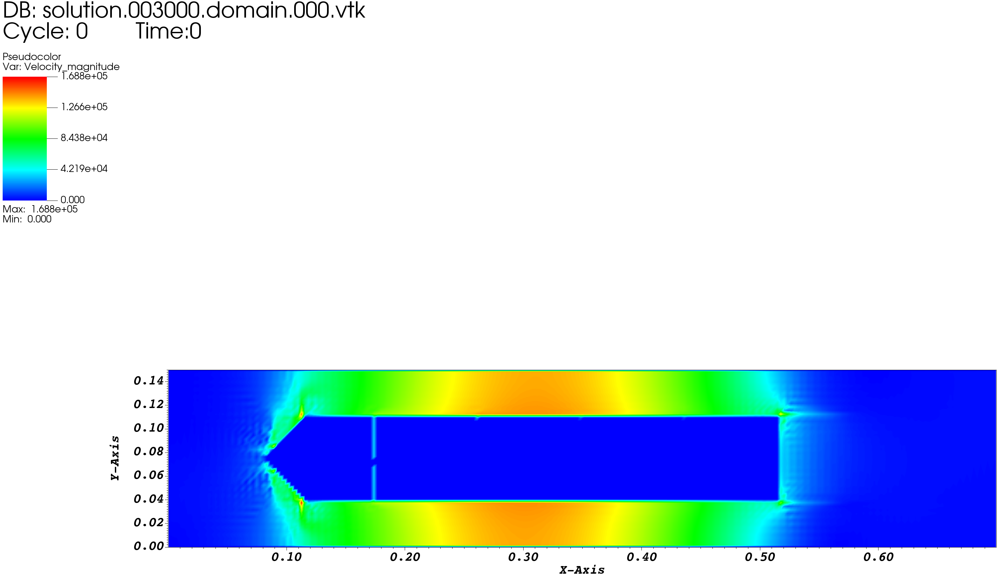
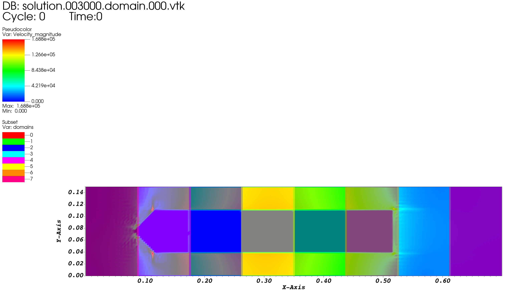
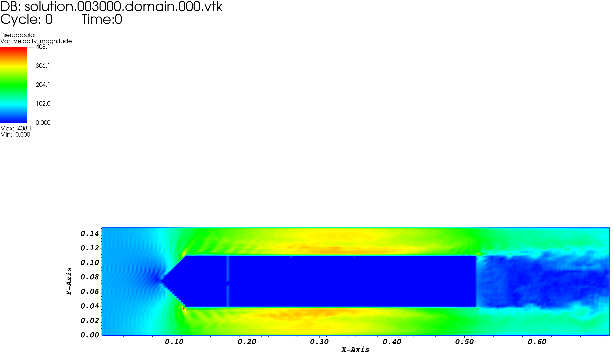
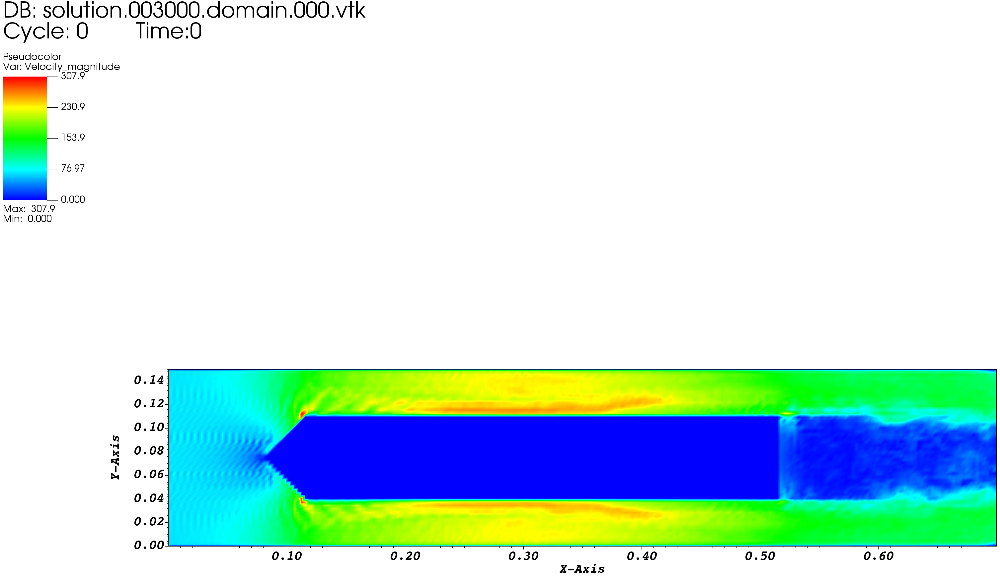
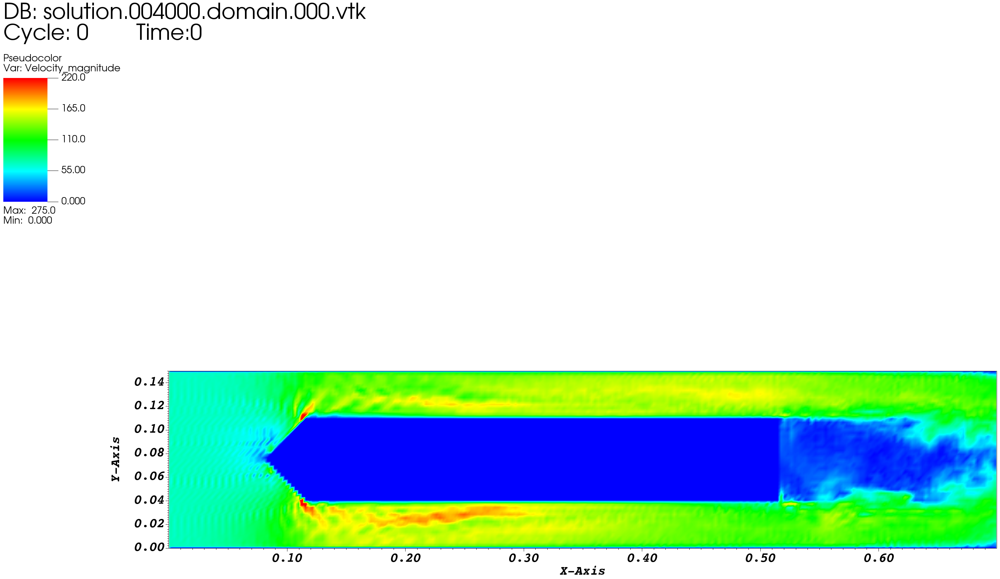

# 长固体模型流动测试

# 长固体模型流动测试和修正

## 对照算例: BOFFIN计算结果

### 瞬态速度(Velocity_magnitude)

* At time step 3000

## 问题算例: AECSC-IBM V1.0 计算结果

* At time step 1000

* At time step 3000

* 叠加并行分块

## 修正算例1

* At time step 3000

## 修正算例2

* At time step 3000

## 修正算例3

* At time step 4000

