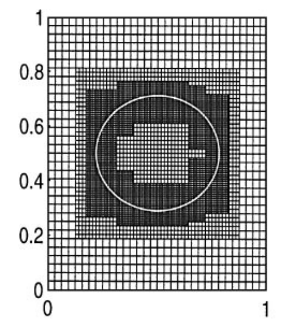
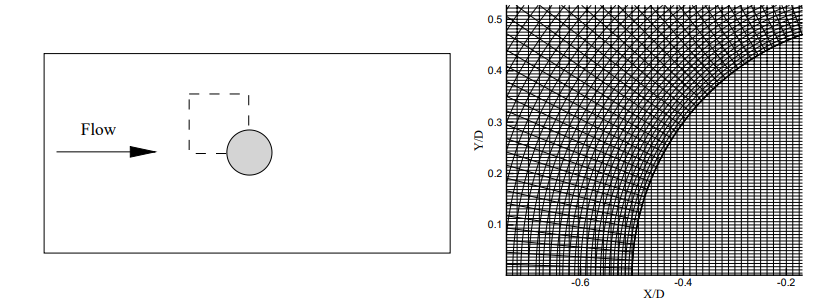
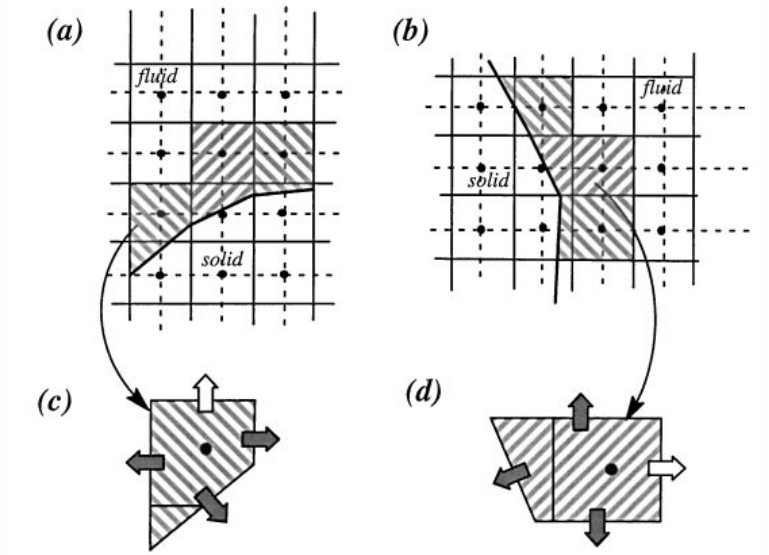

# 一种浸没边界及网格处理建模方法

# 一种浸没边界及网格处理建模方法


graph TB;
	start(开始) --> mpi[MPI并行初始化]
	mpi --> init[读取输入文件与存储初始化]
	init --> random[随机场初始化]
	random --> geom[计算域背景网格读取与处理]
	geom --> imbinput[浸没边界网格生成与初始化]
	imbinput --> other[初始化喷雾,燃烧,湍流进口等]
	subgraph 主循环
		other --> bdy[边界条件设置]
		bdy --> sgs[亚网格黏度计算]
		sgs --> courant[计算Courant数和时间步长]
		courant --> ewt[范数计算]
		ewt --> pdf[TPDF化学反应计算]
		subgraph 时间步内求解器迭代
			pdf --> sgs2[亚网格黏度计算]
			subgraph u,v,w,压力梯度,混合分数计算
				sgs2 --> vel[速度场计算]
				vel --> bndry1[设置边界条件标量场]
				bndry1 --> grad[梯度场计算]
				grad --> condif[变量集合系数阵计算]
				condif --> cmod[时间离散中心差分]
				cmod --> source[速度,混合分数源项计算]
				source --> bndry2[修正边界条件常数矩阵]
				bndry2 --> step[时间步推进]
				step --> cgstab[稳定双共轭梯度法求解器]
				cgstab --> bndry3[更新壁面边界类型设置]
			end
			bndry3 --> pbsrhl[分块边界信息交换]
			pbsrhl --> densty[密度求解与压强求解]
			densty --> gvctr[压力平滑处理]
			gvctr --> bndry11[设置边界条件标量场]
			bndry11 --> press[压力校正]
			press --> cgsol[共轭梯度法求解]
			cgsol --> bndry33[更新壁面边界类型设置]
			bndry33 --> pbsrhll[分块边界信息交换]
		end
		pbsrhll --> vtk[可视化输出]
		vtk --> mpiend[MPI并行结束]
	end
	mpiend --> allend(结束)


## 技术领域

本发明涉及一种用于航空发动机燃烧室等复杂结构内两相湍流燃烧数值模拟的浸没边界方法以及与之配套的网格生成方法。它涉及到计算流体力学、化学流体力学、航空燃气涡轮发动机燃烧室设计以及网格生成算法，属于航空燃气涡轮发动机燃烧室设计分析和两相湍流燃烧数值模拟领域。

## 背景技术

### 航空燃气涡轮发动机燃烧室数值模拟

燃烧室是航空发动机中实现能量转换，影响整机性能的核心部件。燃烧室几何结构复杂，其中的两相湍流燃烧现象存在强烈非线性关系，实验研究难度大、耗时长、风险高，迫切需求高保真高精度数值模拟。拥有先进发动机制造技术的国家在燃烧室数值模拟软件的研发中都投入了大量资金与科研力 量，开发了如美国国家燃烧仿真代码（NCC）等可用于航空发动机燃烧室设计的数值模拟软件。近年来，我国也逐渐重视发展航空发动机数值模拟软件，开发了流场仿真软件如AXX和APXX等。但国内对于航空发动机燃烧室的仿真和设计多采用商用软件，如PHOENICS，ANSYS-Fluent等，受到了严重的技术封锁。

对于燃气轮机燃烧室的数值模拟，大多局限于简化后的燃烧室模型或是结构简单的小型燃烧室。如对仅有一级旋流器的燃烧室简化模型进行计算等。对此，Yee Chee See指出，在真实燃气轮机燃烧室中充分应用LES的关键难点在于几何复杂度和与几何相关的网格划分的复杂度。高分辨率，高精度的燃烧室数值模拟是燃烧仿真的热点之一。莫妲等采用ANSYS-ICEM划分423万网格对三旋流燃烧室进行计算，得出出口温度分布与实验值符合较好的计算结果。丁勇能等采用ANSYS-ICEM-CFD 19.0绘制1.7亿网格对重型燃气轮机的单筒燃烧室进行数值模拟，得出分辨率较高，准确性较好的燃烧场模拟结果。采用ICEM等软件划分大规模网格难度较高，耗费大量时间，且网格质量难以保证。大规模网格的划分是燃烧室高分辨率仿真的难点之一。

### 浸没边界方法

浸没边界方法最早由Peskin提出，将复杂结构的边界模化为N-S方程中的一种彻体力，用**笛卡尔网格**解决网格生成困难问题并提高计算效率。

`Peskin C. S. Flow patterns around heart valves: a numerical method ［J］．J Comput Phys, 1972.2：2252－271．`

N-S方程: $\dfrac{\partial (\rho u_i)}{\partial t}+\nabla\cdot(\rho u_i\vec{u})=\nabla\cdot(\mu\nabla\vec{u})+(-\dfrac{\partial p}{\partial x_i}+S_{u_i})$

令 $F=S_{u_i}$ ，代表单位体积收受到的彻体力。

一般用于：

* 模拟存在复杂结构的流场
* 模拟动边界问题

可以用于解决航空燃气涡轮发动机燃烧室高分辨率仿真的网格划分问题。

但也存在以下缺点：

* 浸没边界方法所采用的网格在曲面边界为锯齿状，不能精确地反应实际几何模型的表面形状，在燃烧数值模拟中液相燃料粒子追踪模拟时不能正确地计算**粒子反弹**，影响了对燃气轮机燃烧室喷雾液滴运动的模拟。

* 浸没边界法在计算中经常采用等距的**笛卡尔网格**，在一定程度上浪费了计算资源`[浸入边界法及其应用_宫兆新]`。如果仅在一些需要加密的地方对网格进行局部加密，将会有效提高模拟效率，节约计算资源。



Roma等`[Roma A M, Peskth C S, Berger M J. An adaptive version of the immersed boundary method[J]. J Comput Phys, 2000, 153:509-534.]`采用自适应浸没边界法，对浸没边界附近的网格进行加密，加密区由逐级嵌套的加密层构成，每层包含一组互不交叠的矩阵网格区。

在数值求解时使用 Crank-Nicholson 法，即在混合 MAC 网格上应用 二阶投影法求解 N-S 方程。 在每一层的计算中则采用 Gauss-Seidel 法在混合 MAC 网格上求解，而每一层之间的数值传递则采用多层多网格法`[Mthion M L. Two methods for the study of vortex patch evolution on locally refined grids[D]:Ph.D.thesis.Lawrence Berkeley Labo,ratury-University of California,Berkeley,1994][Roma A M. A multilevel self-adaptive version of the immersed boundary method[D]:Ph.D thesis.Courant Institute of Mathematical Science-New York University,1996.]`。

自适应性浸入边界法缺点在于很难获得非线性对流项的高阶离散，因此**不适合模拟高雷诺数运动**。





为模拟高雷诺数运动，虚拟网格有限差分法（Ghost-cell FDM）法将虚拟网格定义在浸没边界内部，保证每个虚拟网格至少与流场中的一个网格点相邻，流场计算在遇到虚拟网格就会停止，不需要计算浸入边界内部的网格点，虚拟网格上的各种变量值由周围流体网格点插值得到`[Majumdar S, laccarino G, Durbin P A. RANS solver with adaptive structured boundary non-conforming grids[C]. Annu Res Briefs, 2001, 353－366.]`。





同样是为模拟高雷诺数运动，切割网格法则首先切割浸入边界所在的网格：如果初始网格的中心是流体，则切割后的网格成为一个 新的独立网格；如果不是，则与相邻网格合并。（目的是为了防止生成细微网格导致结果出错）。然后，插值计算每个网格面的质流量、对流项、耗散项和压力梯度。`Ye T, Mittal R, Udatjynar H S, Shyy W. An accurate Cartesian grid method for viscous incompressible flows with complex boundaries[J]. Journal of Computational Physics, 1999, 156: 209-240.`

切割网格法不需要求解浸入边界内部网格点，又同时保证了边界附近解的精度，目前己成功地应用于二维复杂流动，但对于三维问题模拟尚存在一定的困难，主要是因为切割会产生复杂的网格使流场控制方程的离散变得困难。



### 小结

综上所述，考虑航空发动机燃烧室等复杂模型中的网格生成困难问题，本发明首先建立基于Möller-Trumbore算法对流场基础网格进行扫描的浸没边界网格生成方法。其次，针对浸没边界方法引起的计算效率下降问题，本发明利用坐标变换建立基于非笛卡尔结构网格的两相湍流燃烧模拟基础网格和相应的Navier-Stokes方程组的大涡模拟（LES）求解方法，结合浸没边界方法形成基于一种浸没边界和非笛卡尔网格的流动模拟方法。最后在网格生成过程中获取壁面网格法向量，增加锯齿网格边界粒子反弹算法，结合输运概率密度函数方程（TPDF）、例子破碎和蒸发模型等算法，实现了对航空燃气涡轮发动机燃烧室等复杂结构内的三维高分辨率两相湍流燃烧数值模拟。本发明提出了一种两相湍流燃烧数值模拟中用于航空发动机燃烧室等复杂模型内的浸没边界网格生成与应用方法，相比传统燃烧数值模拟方法能更快速地生成高质量、高分辨率、易于分块并行的网格，相比其他浸没边界方法能在保证对流项离散精度前提下，通过局部加密提高模拟效率，并且可以正确处理燃料液滴粒子在壁面处的反弹或黏附，适用于航空发动机燃烧室两相湍流燃烧数值模拟。

## 基网格局部加密与坐标变换



| 坐标轴名 | 原始坐标系 | 变换后坐标系 |
| :------: | :--------: | :----------: |
|   $x$    |   $x_1$    |   $\xi_1$    |
|   $y$    |   $x_2$    |   $\xi_2$    |
|   $z$    |   $x_3$    |   $\xi_3$    |

坐标变换 Jacobian 矩阵 $J_{ij}=\dfrac{\partial x_i}{\partial\xi_i}$

其代数余子式 $A=|J||J|^{-1}$

根据链式法则，有 $\dfrac{\partial \phi}{\partial x_i}=\dfrac{A_{ij}}{|J|}\dfrac{\partial \phi}{\partial\xi_j}$



> 原始坐标系中滤波后的N-S方程张量形式为：
>
> $\dfrac{\partial \bar{\rho}}{\partial t}+\dfrac{\partial \bar{\rho}\tilde{u_i}}{\partial{x_j}}=0\\\ \dfrac{\partial \bar{\rho}\tilde{u_i}}{\partial{t}}+\dfrac{\partial \bar{\rho}\widetilde{u_iu_j}}{\partial x_j}=-\dfrac{\partial \bar{p}}{\partial x_i}+\dfrac{\partial \bar{\sigma_{ij}}}{\partial x_j}$

任何 $\vec{x}\rightarrow\vec{\xi}$ 的坐标变换都不存在 $\dfrac{\partial \frac{A_{ik}}{|J|}}{\partial\xi_k}$ 项，

因此在变换后坐标系中，滤波后的N-S方程张量形式为：

* 连续方程：

  $\dfrac{\partial \bar{\rho}}{\partial t}+\dfrac{\partial}{\partial\xi_k}(\dfrac{A_{ki}}{|J|}\bar{\rho}\tilde{u_i})=0$

* 动量方程：

  $\dfrac{\partial\bar{\rho}\tilde{u_i}}{\partial t}+\dfrac{\partial}{\partial \xi_k}(\dfrac{A_{kj}}{|J|}\bar{\rho}\tilde{u_i}\tilde{u_j})=-\dfrac{A_{ki}}{|J|}\dfrac{\partial\bar{p}}{\partial\xi_k}+\dfrac{A_{ki}}{|J|}S_{u_i}+\dfrac{\partial}{\partial\xi_k}(\dfrac{A_{ki}}{|J|})[\mu_t\dfrac{A_{lj}}{|J|}\dfrac{\partial\tilde{u_i}}{\partial\xi_l}+\mu_t\dfrac{A_{li}}{|J|}\dfrac{\partial\tilde{u_j}}{\partial\xi_l}]$

* 标量守恒方程：

  $\dfrac{\partial\bar{\rho}\tilde{\phi}}{\partial t}+\dfrac{\partial}{\partial \xi_k}(\dfrac{A_{ki}}{|J|}\bar{\rho}\tilde{u_i}\tilde{\phi})=\dfrac{\partial}{\partial\xi_k}(\dfrac{A_{ki}}{|J|})[\mu_t\dfrac{A_{li}}{|J|}\dfrac{\partial\tilde{\phi}}{\partial\xi_l}]$

其中，$\mu_t$ 考虑了分子黏度和湍流黏度，扩散项包括粘性应力和亚网格尺度应力，

将应变张量和湍动能的迹的影响作用加入热力学压强，形成虚拟压强 $p=p_{ther}+\frac{2}{3}\mu_t(\frac{A_{ml}}{|J|}\frac{\partial u_m}{\partial \xi_l}+k)\delta_{ij}$

用Gauss-Ostrogradskii定理将守恒方程在体积$\partial V$上积分，得守恒方程积分形式：

* 连续方程：

  $\int_{\partial V}\dfrac{\partial \bar{\rho}}{\partial t}+\int_{\partial S}\underbrace{A_{ik}\bar{\rho}\tilde{u_i}}_{G_k}n_kdS=0$

* 动量方程：

  $\int_{\partial V}\dfrac{\partial\bar{\rho}\tilde{u_i}}{\partial t}dV+\underbrace{\int_{\partial S}G_k\tilde{u_i}n_kdS}_{\text{对流项}}=-\int_{\partial V}A_{ki}\dfrac{\partial\bar{p}}{\partial\xi_k}dV+\underbrace{\int_{\partial V}A_{ki}S_{u_i}dV}_{\text{浸没边界体积力源项}}+\underbrace{[\mu_t\dfrac{A_{lj}A_{kj}}{|J|}\dfrac{\partial\tilde{u_i}}{\partial\xi_l}+\mu_t\dfrac{A_{li}A_{kj}}{|J|}\dfrac{\partial\tilde{u_j}}{\partial\xi_l}]n_kdS}_{\text{扩散项}}$

  *上式中压力项被视为彻体力，按照非保守力处理。*

* 标量守恒方程：

  $\int_{\partial V}\dfrac{\partial \bar{\rho}\tilde{\phi}}{\partial t}dV+\underbrace{\int_{\partial S}G_k\tilde{\phi}n_kdS}_{\text{对流项}}=\underbrace{\int_{\partial S}[\mu_t\dfrac{A_{li}A_{ki}}{|J|}\dfrac{\partial\tilde{\phi}}{\partial \xi_l}]n_k}_{\text{扩散项}}$

## 扫描几何模型生成浸没边界网格

...

## 流固耦合边界法向量处理

...


gantt
    dateFormat  YYYY-MM-DD
    title AECSC-IBM V1.0
    section  开发阶段 1
    边界处理基本功能实现         :done,    des1, 2021-05-24,2021-06-15
    浸没边界网格生成             :done,    des2, 2021-05-31,2021-06-06
    浸没边界法向量计算           :done,    des3, 2021-06-15,2021-06-20
    两相例子反弹               :done,    des4, 2021-06-15,2021-06-20
    算例测试                  :active,  des5, 2021-07-01,2021-12-31
    方法综述&专利申请           :active,  des6, 2021-08-25, 60d
    边界速度处理               :         des7, 2021-09-03, 60d
    程序整理                   :         des8, after des7, 7d
    section  开发阶段 2
    动边界问题               :         des1, 2021-12-30, 1d
    弹性边界问题              :         des2, 2021-12-30, 1d
    并行优化                 :         des3, 2021-12-30, 1d
    自适应网格                :         des3, 2021-12-30, 1d


