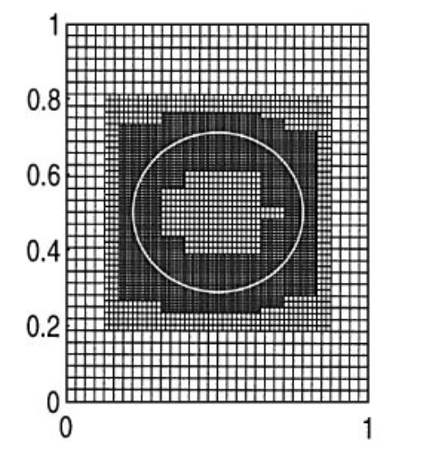
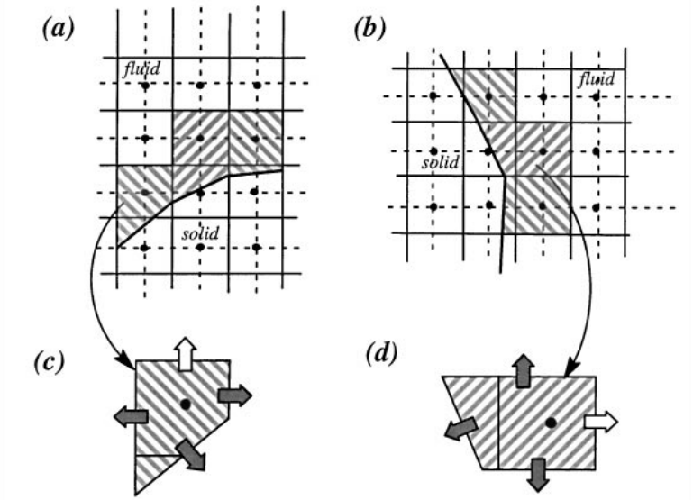

# 浸没边界方法

# 浸没边界方法

## 用途

* 模拟存在复杂结构的流场
* 模拟动边界问题

## Peskin 直接力法-柔性边界

浸没边界方法最早由Peskin提出，将复杂结构的边界模化为N-S方程中的一种彻体力，用**笛卡尔网格**解决网格生成困难问题并提高计算效率。

`Peskin C S. Flow patterns around heart valves: a numerical method[J]. J Comput Phys, 1972.10(2)：252－271．`

N-S方程: $\dfrac{\partial (\rho u_i)}{\partial t}+\nabla\cdot(\rho u_i\vec{u})=\nabla\cdot(\mu\nabla\vec{u})+(-\dfrac{\partial p}{\partial x_i}+S_{u_i})$

令 $F=S_{u_i}$ ，代表单位体积收受到的彻体力。

Peskin等将浸没边界方法（直接力）应用于柔性边界问题

`Roma A M, Peskin C S, Berger M J. An Adaptive Version of the Immersed Boundary Method[J]. J Comput Phys, 1999, 153(2): 509-534.`

`Lai M, Peskin C S. An Immersed Boundary Method with Formal Second-Order Accuracy and Reduced Numerical Viscosity. J Comput Phys, 2000, 160(2): 705-719.`

`Zhu L, Peskin C S. Simulation of a Flapping Flexible Filament in a Flowing Soap Film by the Immersed Boundary Method. J Comput Phys, 2002, 179(2): 452-468.`

## Goldstein 直接力法+虚拟边界法-刚体边界

`Goldstein D, Handler R, Sirovich L. Modeling a No-Slip Flow Boundary with an External Force Field. Journal of Computational Physics, 1993, 105(2): 354-366. `

`Goldstein D, Handler R, Sirovich L. Direct Numerical Simulation of Turbulent Flow Over a Modeled Riblet Covered Surface, 1993, 105(2): 354-366.`

## Yusof 离散力法-可压缩流动

将体积力源项加入离散方程中。

将“直接力”方法中的浸没边界源项转换为物面边界条件局部重构。

`Yusof J M, Combined Immersed Boundaries/B-Spines Methods for Simulations of Flows in Complex Geometries. CTR Annual Research Briefs, NASA Ames/Stanford University, 1997.`

## 离散边界和流体的链接

用函数 $D_{ij}(\vec{x_k}),\vec{x_k}\in Boundary$ 链接边界和流体的两种方式：

* 通过评估浸没边界给定点的速度场
* 通过**将边界力分散到附近的流体域网格点上**



Roma等`[Roma A M, Peskth C S, Berger M J. An adaptive version of the immersed boundary method[J]. J Comput Phys, 2000, 153:509-534.]`采用自适应浸没边界法，对浸没边界附近的网格进行加密，加密区由逐级嵌套的加密层构成，每层包含一组互不交叠的矩阵网格区。

在数值求解时使用 Crank-Nicholson 法，即在混合 MAC 网格上应用 二阶投影法求解 N-S 方程。 在每一层的计算中则采用 Gauss-Seidel 法在混合 MAC 网格上求解，而每一层之间的数值传递则采用多层多网格法`[Mthion M L. Two methods for the study of vortex patch evolution on locally refined grids[D]:Ph.D.thesis.Lawrence Berkeley Labo,ratury-University of California,Berkeley,1994][Roma A M. A multilevel self-adaptive version of the immersed boundary method[D]:Ph.D thesis.Courant Institute of Mathematical Science-New York University, 1996.]`。

自适应性浸入边界法缺点在于很难获得非线性对流项的高阶离散，因此**不适合模拟高雷诺数运动**。





为模拟高雷诺数运动，虚拟网格有限差分法（Ghost-cell FDM）法将虚拟网格定义在浸没边界内部，保证每个虚拟网格至少与流场中的一个网格点相邻，流场计算在遇到虚拟网格就会停止，不需要计算浸入边界内部的网格点，虚拟网格上的各种变量值由周围流体网格点插值得到`[Majumdar S, laccarino G, Durbin P A. RANS solver with adaptive structured boundary non-conforming grids[C]. Annu Res Briefs, 2001, 353－366.]`。





同样是为模拟高雷诺数运动，切割网格法则首先切割浸入边界所在的网格：如果初始网格的中心是流体，则切割后的网格成为一个 新的独立网格；如果不是，则与相邻网格合并。（目的是为了防止生成细微网格导致结果出错）。然后，插值计算每个网格面的质流量、对流项、耗散项和压力梯度。`Ye T, Mittal R, Udatjynar H S, Shyy W. An accurate Cartesian grid method for viscous incompressible flows with complex boundaries[J]. Journal of Computational Physics, 1999, 156: 209-240.`

切割网格法不需要求解浸入边界内部网格点，又同时保证了边界附近解的精度，目前己成功地应用于二维复杂流动，但对于三维问题模拟尚存在一定的困难，主要是因为切割会产生复杂的网格使流场控制方程的离散变得困难。



## GCIBM

**Ghost-Cell Immersed Boundary Method** 通过Ghost-Cell方法设置边界条件，在采用浸没边界法计算时保持基础求解器的二阶精度。

 ` Yu-Heng Tseng,  Joel H. Ferzige.  A ghost-cell immersed boundary method for flow  in complex geometry[J].  Journal of Computational Physics, 2003, 192: 593-623.`

## AECSC-IBM

### 边界

> I=1,

| South边界标记IBS | 类型 | 系数阵COEF |
| :-: | :-: | :--: |
| -1  | INFLOW | $源项COEF(BPC) += COEF(South)\cdot 进口条件; COEF(South)=0;$ |
|-2| OUTFLOW（零梯度） |$对角阵PC -= COEF(South); COEF(South)=0;$|
|-3| 对称 |---|
|-4| DIRICHLET（固定壁温） | --- |
|-5| NUMANN（零梯度） |---|

#### 壁面边界（IBS = -4，-5）

##### geom: 

根据几何设置$w_1, w_2, w_3$

| i    | $w_1$ |
| :--: | :--: |
| 1    | 1.0  |
|  lp1   |  0.0 |

> $\dfrac{\partial u}{\partial i}=w_1(u_P-u_{South})+(1-w_1)(u_{North}-u_P)$

##### boundary2:

1. **计算法向速度VN**

2. **计算反弹速度VREF**

3. **根据壁面速度分布得到:**

   $GAMS=VISC$或$\dfrac{\tau\cdot DL}{VREF}$

   $TIP = \dfrac{GAMS\cdot DA}{|AJC|\cdot DL}$

4. **速度系数阵设置 (NV = NVU，NVV，NVW)**

   > NVU:

   $对角项PC+=TIP\cdot (1-Norm_x^2)$

   $COEF(South)+=TIP\cdot (1-Norm_x^2)$

   $COEF(BPC) += TIP\cdot Norm_x\cdot (Norm_y\cdot \dfrac{\partial v}{\partial i}+Norm_z\cdot \dfrac{\partial w}{\partial i})$

5. 标量系数阵设置 (NUMANN)

   $对角项COEF(PC)-=COEF(South)$

   $COEF(South)=0$

##### boundary3:

1.  边界速度, 焓值重设为初始

   $F(IJKS)=FSTH(NV,IJK)$

2. 标量零梯度(NEUMANN)

   $f(ijks)=f(ijkp)$

   

## AECSC-IBM.dev

$a_p\phi_p = \sum a_{nb_2}\phi_{nb_2}+K_{vol}b$

$a_p\phi_p = a_{N_2}\phi_{N_2}+a_{S_2}\phi_{S_2}+a_{W_2}\phi_{W_2}+a_{E_2}\phi_{E_2}+a_{L_2}\phi_{L_2}+a_{R_2}\phi_{R_2}+K_{vol}b$

$a_{nb_2}\phi_{nb_2}$ 由  $a_{nb_1}\phi_{nb_1}$ 插值求出

$K_{vol}$ 只与控制体变换前后体积有关

单位：m/s

Unit:  m/s

温度云图

