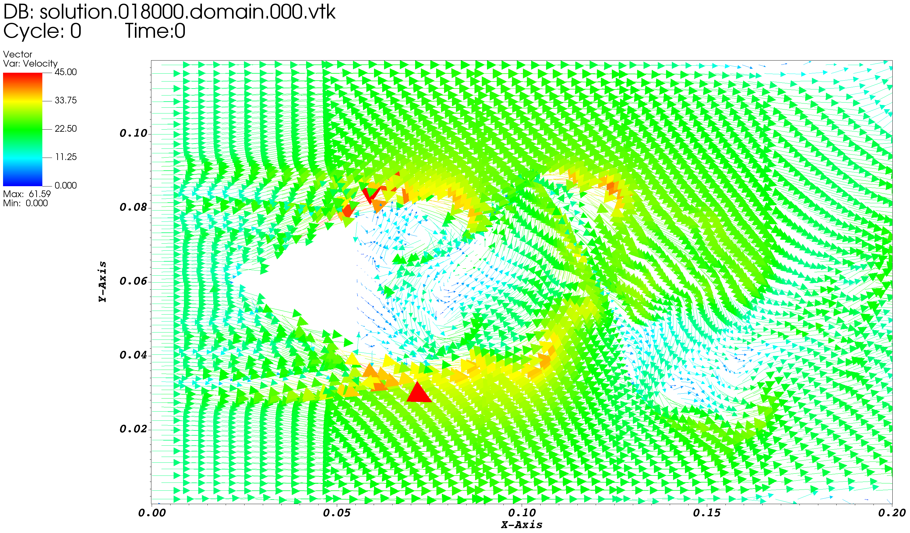

# 三角钝体测试

# AECSC-IBM 三角钝体测试

## 对照算例：BOFFIN计算结果

* At Time-Step 20000

### 网格

###  瞬态速度(Velocity_magnitude)

* 标尺: (0, 45) m/s

### 平均流向速度(MEAN_U)

* 标尺: (-15, 35) m/s

### 局部瞬态速度矢量(Velocity)

* 标尺:  (0, 45) m/s

* 区域：x = (0.00, 0.20) m

## 对照算例：AECSC-IBM V1.0

### 网格

### 瞬态速度(Velocity_magnitude)

* 标尺: (0, 45) m/s

### 平均流向速度(MEAN_U)

* 标尺: (-15, 35) m/s

### 局部瞬态速度矢量(Velocity)

* 标尺:  (0, 45) m/s

* 区域：x = (0.00, 0.20) m

## 改进版本-面邻居边界函数

`ref_weight = 0.0`

只处理(无梯度边界和壁面速度函数处理) 与固壁网格**面相邻**的流体网格，包括N,S,W,E,L,R。

网格同上。

### 瞬态速度(Velocity_magnitude)

* 标尺: (0, 45) m/s

### 平均流向速度(MEAN_U)

* 标尺: (-15, 35) m/s

###  局部瞬态速度矢量(Velocity)

* 标尺:  (0, 45) m/s

* 区域：x = (0.00, 0.20) m

## 改进版本-全邻居边界函数

`ref_weight = 1.0`

处理(无梯度边界和壁面速度函数处理) 与固壁网格**面相邻、点相邻、线相邻**的流体网格，

包括：

| 面邻居(6)   | 线邻居(12)                          | 点邻居(8)                       |
| ----------- | ----------------------------------- | ------------------------------- |
| N,S,W,E,L,R | NW,NE,SW,SE,NL,NR,SL,SR,WL,WR,EL,ER | NWL,NWR,NEL,NER,SWL,SWR,SEL,SER |

网格同上。

### 瞬态速度(Velocity_magnitude)

* 标尺: (0, 45) m/s

### 平均流向速度(MEAN_U)

* 标尺: (-15, 35) m/s

### 局部瞬态速度矢量(Velocity)

* 标尺:  (0, 45) m/s

* 区域：x = (0.00, 0.20) m

## 改进版本-带权重全邻居边界函数

`ref_weight = 0.5`

处理(无梯度边界和壁面速度函数处理) 与固壁网格**面相邻、线相邻、点相邻**的流体网格，

**线相邻、点相邻**流体网格边界处理乘权重，即认为这两种流体网格只有一部分靠着固壁

###  瞬态速度(Velocity_magnitude)

* 标尺: (0, 45) m/s

### 平均流向速度(MEAN_U)

* 标尺: (-15, 35) m/s

### 局部瞬态速度矢量(Velocity)

* 标尺:  (0, 45) m/s

* 区域：x = (0.00, 0.20) m

## 200万网格全邻居函数

### 瞬态速度(Velocity_magnitude)

* 标尺: (0, 45) m/s

### 平均流向速度(MEAN_U)

* 标尺: (-15, 35) m/s

### 局部瞬态速度矢量(Velocity)

* 标尺:  (0, 45) m/s
* 区域：x = (0.00, 0.20) m

## 局部网格重构(面邻居函数)

### 瞬态速度(Velocity_magnitude)

* 标尺: (0, 45) m/s

### 平均流向速度(MEAN_U)

* 标尺: (-15, 35) m/s

### 局部瞬态速度矢量(Velocity)

* 标尺:  (0, 45) m/s
* 区域：x = (0.00, 0.20) m

