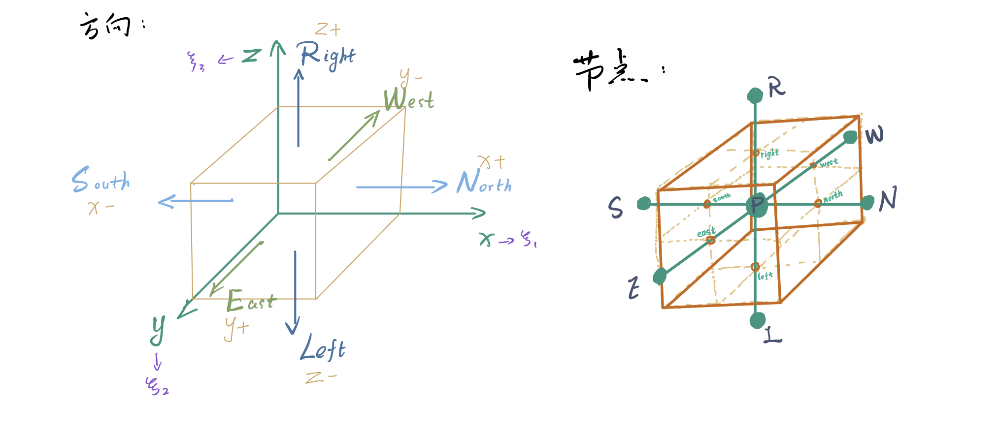

# 大涡模拟

# 大涡模拟

## 控制方程


$u_i=u_x\vec{i}+u_y\vec{j}+u_z\vec{k}$
$\tau_{ij}=\begin{bmatrix}\tau_{11}&\tau_{12}&\tau_{13}\\\ \tau_{21}&\tau_{22}&\tau_{23}\\\ \tau_{31}&\tau_{32}&\tau_{33}\end{bmatrix}$
$u_i x_i=u_1 x_1 + u_2 x_2 +u_3 x_3$


* **质量守恒方程 (连续方程)**

  $\dfrac{\partial \rho}{\partial t}+\dfrac{\partial \rho u_i}{\partial x_i}=0$

  也可写作： $\dfrac{\partial \rho}{\partial t}+\nabla\cdot(\rho \vec{V})=0$
  
  

  汉密尔顿算子$\nabla$：

   $\nabla\cdot\vec{a}=div(\vec{a})=\dfrac{\partial a_x}{\partial x}+\dfrac{\partial a_y}{\partial y}+\dfrac{\partial a_z}{\partial z}$表示散度(标量)，

   $\nabla\vec{a}=grad(\vec{a})=(\dfrac{\partial a_x}{\partial x},\dfrac{\partial a_y}{\partial y},\dfrac{\partial a_z}{\partial z})$表示梯度(矢量)，
  
  拉普拉斯算子$\Delta$：
  
  $\Delta\vec{a}=\nabla^2\vec{a}=\nabla\cdot\nabla\vec{a}=\dfrac{\partial^2 a_x}{\partial^2 x}+\dfrac{\partial^2 a_y}{\partial^2 y}+\dfrac{\partial^2 a_z}{\partial^2 z}$
  
  
  
  
  
  欧拉形式（即上式）: $\dfrac{\partial \rho}{\partial t}+\nabla\cdot(\rho \vec{V})=0$
  
  含义: 控制体质量的变化等于流入控制体的质量
  
  拉格朗日形式: $\dfrac{D\rho}{Dt}+\rho(\nabla\vec{V})=0$
  
  含义: 体系的密度由变化体系的体积变化引起
  

* **牛顿流体的动量守恒方程 (N-S方程)**

  $\dfrac{\partial\rho u_i}{\partial t}+\dfrac{\partial\rho u_i u_j}{\partial x_j}=-\dfrac{\partial P}{\partial x_i}+\dfrac{\partial \sigma_{ij}}{\partial x_i}+f(x,t)$

  {{< admonition type=tip title="牛顿流体的应力张量 $\sigma_{ij}$" open=false >}}

  $\sigma_{ij}=2\mu S_{ij}-\frac{2}{3}\mu S_{kk}\delta_{ij}$

  对牛顿流体,应力张量的分量可以分解为分子黏度和局部速度梯度的函数

  分子黏度 $\mu$ 依赖于温度 $T$,由Sutherland定律等幂律给出

  

  

  拉格朗日形式: $\dfrac{D\vec{V}}{Dt}=-\dfrac{\mu}{\rho}\nabla^2\vec{V}+\dfrac{1}{3}\dfrac{\mu}{\rho}\nabla\cdot(\nabla \vec{V})-\dfrac{1}{\rho}\nabla P+\vec{f_b}$

  含义: 体系动量变化 = 粘性正应力项+粘性切应力项+压差力项+体积力项

  

* **密度状态方程**

  $\dfrac{P}{\rho}=\dfrac{R^0T}{W}$    其中，$R^0$为气体通用常数，$W$为流体分子量

  

  **质量守恒方程**和**动量守恒方程**中的密度$\rho$为未知数

  **能量守恒方程**和**密度状态方程**都是为了求解 $\rho$

  **密度状态方程**将未知数 $\rho$ 转变为 $T$, 再结合**混合物焓守恒方程**求解

  

* **混合物焓守恒方程**

* **控制方程的通用形式**

  $\dfrac{\partial(\rho\phi)}{\partial t}+\dfrac{\partial(\rho u_i\phi)}{\partial x_i}=\dfrac{\partial}{\partial x_i}(\Gamma\dfrac{\partial \phi}{\partial x_i})+S$

  式中各项依次为：

  瞬态项(Transient)，对流项(Convective)，扩散项(Diffusive)，源项(Source) (term)

  其中，$\phi$表示通用变量，$\Gamma$ 代表广义扩散系数，$S$ 代表广义源项。

  | 对应含义 | $\phi$ | $\Gamma$ | $S$ |
  |:---: | :---: | :---: | :---: |
  | 连续方程 |1|0|0|
  | 动量方程 |$u_i$|$\mu$|$-\frac{\partial p}{\partial x_i}+S_i$|
  | 能量方程 |T|$\frac{k}{c}$|$S_T$|
  | 组分方程 |c_s|$D_s\rho$|$S_S$|

所有控制方程都可以经过适当的数学处理，将因变量，时变项，对流项，扩散项写为标准形式，然后将右侧其余各项集中起来定义为源项，从而化为通用微分方程。

### 守恒型控制方程

将对流项采用散度的形式表示，物理量都在微分号内，这种形式的控制方程为守恒型控制方程(上述均为守恒型)。

与非守恒型相比，守恒型更能保持物理量守恒的性质，在有限体积法(FVM)中可方便地建立离散方程。

| 名称 | 形式 |
| :---: | :--- |
| 连续方程 |$\dfrac{\partial \rho}{\partial t}+\nabla\cdot(\rho\vec{u})=0+0$|
| 动量方程 |$\dfrac{\partial (\rho u_i)}{\partial t}+\nabla\cdot(\rho u_i\vec{u})=\nabla\cdot(\mu\nabla\vec{u})+(-\dfrac{\partial p}{\partial x_i}+S_{u_i})$|
| 能量方程 |$\dfrac{\partial (\rho T)}{\partial t}+\nabla\cdot(\rho T\vec{u})=\nabla\cdot(\dfrac{k}{c}\nabla T)+S_T$|
| 状态方程 |$\dfrac{P}{\rho}=\dfrac{R^0T}{W}$|

### 离散形式控制方程

* 通用形式

$\dfrac{\partial (\rho \phi)}{\partial t}+\nabla \cdot (\rho \vec{u} \phi)=\nabla \cdot (\Gamma \nabla \phi)+S$

* * 瞬态项

  $\int_{t}^{t+\Delta t} \int_{\Delta V} \dfrac{\partial(\rho \phi)}{\partial t}dVdt = \int_{\Delta V}[\int_{t}^{t+\Delta t}\rho \dfrac{\partial\phi}{\partial t}dt]dV = \rho ^0 (\phi_P-\phi_P^0)\Delta V$

* * 源项

  $\int_{t}^{t+\Delta t} \int_{\Delta V}SdVdt=\int_{t}^{t+\Delta t} S\Delta V dt=\int_{t}^{t+\Delta t}(S_c+S_P\phi_P)\Delta V dt=\int_{t}^{t+\Delta t}(S_c\Delta V +S_P\phi_P\Delta V )dt$

* * 对流项

  $\int_{t}^{t+\Delta t} \int_{\Delta V}\nabla \cdot (\rho \vec{u} \phi)dVdt=\int_t^{t+\Delta t}[(\rho u \phi A)_e-(\rho u \phi A)_w+(\rho u \phi A)_n-(\rho u \phi A)_s+(\rho u \phi A)_l-(\rho u \phi A)_r]$

  $=\int_t^{t+\Delta t}[(\rho u A)_e \phi_e-(\rho u A) \phi+(\rho u A)_n \phi_n-(\rho u A)_s \phi_s+(\rho u A)_l \phi_l-(\rho u A)_r \phi_r]$

* * 扩散项

  $\int_{t}^{t+\Delta t} \int_{\Delta V}\nabla \cdot (\Gamma \nabla \phi)dVdt=\int_{t}^{t+\Delta t} [(\Gamma \dfrac{\partial \phi}{\partial x}A)_e-(\Gamma \dfrac{\partial \phi}{\partial x}A)_w+(\Gamma \dfrac{\partial \phi}{\partial x}A)_n-(\Gamma \dfrac{\partial \phi}{\partial x}A)_s+(\Gamma \dfrac{\partial \phi}{\partial x}A)_l-(\Gamma \dfrac{\partial \phi}{\partial x}A)_r]$

  $=\int_{t}^{t+\Delta t} [(\Gamma_e A_e \dfrac{\phi_E-\phi_P}{(\delta x)_e})-(\Gamma_w A_w \dfrac{\phi_W-\phi_P}{(\delta x)_w})+(\Gamma_n A_n \dfrac{\phi_N-\phi_P}{(\delta x)_n})-(\Gamma_s A_s \dfrac{\phi_S-\phi_P}{(\delta x)_s})+(\Gamma_l A_l \dfrac{\phi_L-\phi_P}{(\delta x)_l})-(\Gamma_r A_r \dfrac{\phi_R-\phi_P}{(\delta x)_r})$

  

  处理 1：在对流项中引入离散格式用节点物理量表示界面物理量

  处理 2：在对流项、扩散项、源项中引入全隐式时间积分，例如：$\int_{t}^{t+\Delta t}\phi_P dt = \phi_P \Delta t$

  得到**瞬态对流-扩散问题离散方程**：

  $A_P\phi_P=A_E\phi_E+A_W\phi_W+A_N\phi_N+A_S\phi_S+A_L\phi_L+A_R\phi_R+S_c$

## 滤波



大涡模拟(LES)对大尺度湍流运动进行直接计算，

而对于这些运动导致的小于计算网格尺度(滤波尺度)的湍流运动被用模型模拟。

传统湍流建模方法(RANS)和LES之间的主要区别是用于推导运动方程的“平均”方法。

LES不涉及系综平均，而是将空间滤波器应用于N-S方程。



通用变量 $\phi (\vec{x},t)$ 为在 $\vec{x}=(x_1,x_2,x_3)$ 处的瞬时流场变量。

经**大涡滤波**过滤后的变量为 $\bar{\phi}(\vec{x},t)$ 。

$\bar{\phi}(\vec{x},t) = \iiint_{-\infty}^{+\infty}G(\vec{x}-\vec{x'},\Delta) \phi(\vec{x},t)d\vec{x'}$ 

$G(\vec{x}-\vec{x'},\Delta)$ 为与网格尺度 $\Delta=\sqrt[3]{\Delta x_1\Delta x_2\Delta x_3}$ 相关的滤波函数。

---

若对 $\phi (\vec{x},t)$ 进行**Fourier变换**, 得:

$\hat{\phi} (\vec{x},t)=\iiint_{-\infty}^{+\infty}\phi(\vec{x},t)e^{-i\kappa_ix_i}d\vec{x}$

再对 $\hat{\phi} (\vec{x},t)$ 进行**大涡滤波**, 得：

$\bar{\hat{\phi}}(\vec{\kappa},t)=\hat{G}(\vec{\kappa},t)*\hat{\phi}(\vec{\kappa},t)$

上式中 $*$ 为卷积符号

由上式可知，滤波函数功能为去除波数(频率)大于某固定值 $\kappa_c$ 的分量( *由Fourier变换得到的* )。

以箱式( *box or top-hat* )滤波为例

$G(\vec{x}-\vec{x'},\Delta)=\begin{cases} \frac{1}{\Delta^3} &\text{if $x_i' \in [x_i-\frac{\Delta}{2},x_i+\frac{\Delta}{2}],\forall i \in 1,2,3$}\\\ 0 &\text{else} \end{cases}$

---

由于滤波带宽 $\Delta$ 可以是空间的函数，空间微分后在滤波与滤波后再空间微分不一致。

$\dfrac{\overline{\partial \phi}}{\partial x_i} \ne \dfrac{\partial \overline{\phi}}{\partial x_i}$    式中不等号两侧的差异为**换向误差(communication error)** 写作$C$。



对于对称核线性积分算子(埃尔米特核线性积分算子)，换向误差和中心差分误差数量级一致。

`(S. Ghosal and P. Moin. The basic equations for the large eddy simulation of turbulent flows in complex geometry. Journal of Computational Physics, 118:24–37, 1995.)`

虽然中心差分的数值误差主要是**弥散**的，换向误差可以近似为纯**耗散**性质。

`M. Wille. Large Eddy Simulation of a Plane Jet in a Cross Flow. PhD thesis, Imperial College, University of London, London, (UK), 1997.`

相对于由SGS模型产生的湍流动能和标量方差的估计耗散而言，换向误差相关的损耗可以忽略不计

`F. Di Mare. Large Eddy Simulation of reacting and non-reacting turbulent flows in complex geometries. PhD thesis, Imperial College, University of London, London, (UK), 2002.`



---

考虑到密度的变化，引入**密度加权滤波算子**, 该算子与未加权的算子性质相同。

因此将**Favre滤波函数**(密度加权滤波函数)定义为：

  $\widetilde{\phi}=\dfrac{\overline{\rho\phi}}{\bar{\rho}}$

滤波后的N-S方程张量形式为：

$\dfrac{\partial \bar{\rho}}{\partial t}+\dfrac{\partial \bar{\rho}\tilde{u_i}}{\partial{x_j}}=0\\\ \dfrac{\partial \bar{\rho}\tilde{u_i}}{\partial{t}}+\dfrac{\partial \bar{\rho}\widetilde{u_iu_j}}{\partial x_j}=-\dfrac{\partial \bar{p}}{\partial x_i}+\dfrac{\partial \bar{\sigma_{ij}}}{\partial x_j}$

根据滤波和空间微分算子的可交换性假设，对输运方程中的变量进行来滤波相当于对输运方程滤波。

* 由于分子黏度与温度的关系是非线性的， $\dfrac{\partial \bar{\sigma_{ij}}}{\partial x_j}$ 中也存在未知数，但其影响很小。

  `U. Piomelli. Large-eddy simulation: achievements and challanges. Progress in Aerospace Sciences, 35:335–362, 1999.`

  因此黏性应力张量可表示为：

  $\bar{\sigma_{ij}}=-2\bar{\mu}\widetilde{S_{ij}}+\delta_{ij}\frac{2}{3}\bar{\mu}\widetilde{S_{kk}}$

* $\dfrac{\partial \bar{\rho}\widetilde{u_iu_j}}{\partial x_j}$ 中的 $\bar{\rho}\widetilde{u_iu_j}$ 为未知项，必须封闭。

  通过引入**亚网格应力项**来封闭：

  $\tau_{ij}=\bar{\rho}(\widetilde{u_iu_j}-\widetilde{u_i}\widetilde{u_j})$

  

  马赫数低时，可忽略SGS应力张量的各向异性部分，忽略各向同性部分

  `M. Y. Erlebacher, G.and Hussaini, C. G. Speziale, and T. A. Zang. Toward the large-eddy simulation of compressible turbulent flows. Journal of Fluid Mechanics, 238:155–185, 1992.`

  Smagorinsky-Lilly模型

  `[1] D. K. Lilly. The representation of small-scale turbulence in numerical simulation rxperiments. In IBM Sci. Comput. Symp. on Environmental Sci. Thomas J. Watson Research Center, Yorktown Heights, NY, 1967.`

  `[2] J. Smagorinsky. General circulation experiments with the primitive equations.I - The basic experiment. Monthly Wheather Review, 91:99–165, 1963.`

  Smagorinsky-Lilly模型动态校准版

  `[1] M. Germano, U. Piomelli, Moin P., and W. H. Cabot. A dynamic sub-grid-scale eddy viscosity model. Physics of Fluids, 23:1760–1765, 1991.`

  `[2] U. Piomelli and J. Liu. Large eddy simulation of rotating channel flows using a localised dynamic model. Physics of Fluids, 7(4):839–848, 1995.`

  

  **Germano**将**SGS应力参数化**为：

  $\tau_{ij}-\frac{1}{3}\tau_{kk}\delta_{ij}=2\rho C_s\Delta^2||\widetilde{S_{ij}}||_F\widetilde{S_{ij}}$

  其中， $||\widetilde{S_{ij}}||_F$ 为应变率张量的Frobenius模量, 滤波器宽度为单元体积的立方根 $\Delta=\sqrt[3]{\Delta x_1\Delta x_2\Delta x_3}$ 。

  `[1] M. Germano. A proposal for redefinition of the turbulent stresses in the filtered navier-stokes equations. Physics of Fluids, 29(7):2323–2324, 1986.`

  `[2]  M. Germano. Turbulence: the filtering approach. Journal of Fluid Mechanics, 238:325–336, 1992.`

  动态过程基本**尺度相似性假设**为：

  $C_S(x_i,t)|_\Delta$

  $=C_S(x_i,t)|_{\alpha\Delta}$

  $=C_S(x_i,t)$

   $\alpha\ge2$

  上式表明模型参数比例是不变的。

  ${\alpha\Delta}$ 为滤波器带宽，其中 $\alpha$ 最佳值为 2，若网格间距一致，$\alpha$ 的值为 3。

  将滤波后的**N-S方程和滤波函数求卷积**，得：

  $\dfrac{\partial\widehat{\bar{\rho}\tilde{u_i}}}{\partial t}+\dfrac{\partial\widehat{\bar{\rho}\widetilde{u_iu_j}}}{\partial x_j}=-\dfrac{\partial\hat{\bar{p}}}{\partial x_i}+\dfrac{\partial \hat{\bar{\sigma_{ij}}}}{\partial x_j}$

  引入滤波器应力$T_{ij}$表示上式第二项:

    $T_{ij}=\widehat{\bar{\rho}\widetilde{u_iu_j}}=\hat{\bar{\rho}}(\widehat{\widetilde{u_iu_j}}-\hat{\tilde{u_i}} \hat{\tilde{u_j}})$

  $T_{ij}$ 和 $\tau_{ij}$ 都是未知的，但可以通过解析应力张量由**Germano恒等式**联系起来。
  
    $L_{ij}=T_{ij}-\tau_{ij}=\hat{\bar{\rho}}(\widehat{\tilde{u_i}\tilde{u_j}}-\hat{\tilde{u_i}}\hat{\tilde{u_j}})$
  
  `M. Germano, U. Piomelli, Moin P., and W. H. Cabot. A dynamic sub-grid-scale eddy viscosity model. Physics of Fluids, 23:1760–1765, 1991.`
  
  若应用**尺度相似性假设**，$T_{ij}$ 和 $\tau_{ij}$ 为相同的函数形式，因此二者的各向异性分量可以表示为：
  
  $\tau_{ij}-\frac{1}{3}\tau_{kk}\delta_{ij}=-2\bar{\rho}(C_S\Delta)^2||\tilde{S_{ij}}||\tilde{S_{ij}}\\\ T_{ij}-\frac{1}{3}T_{kk}\delta_{ij}=-2\hat{\bar{\rho}}(C_S\Delta)^2||\hat{\tilde{S_{ij}}}||\hat{\tilde{S_{ij}}}$
  
  将上式代入 $L_{ij}$ 式，得：
  
  $L_{ij}-\frac{1}{3}L_{kk}\delta_{ij}=-2[\hat{\bar{\rho}}(C_S\alpha\Delta)^2||\hat{\tilde{S_{ij}}}||\hat{\tilde{S_{ij}}}+\widehat{\bar{\rho}(C_S\Delta)^2||\tilde{S_{ij}}||\tilde{S_{ij}}}]$
  
  上式对未知量 $C_S$ 求了卷积，这代表了 5个(由于张量对称且迹为0) 独立的标量 C 的积分方程。Germano假设C不是空间的函数，将上式简化为超定代数方程组：

  $L_{ij}-\frac{1}{3}L_{kk}\delta_{ij}=-2(C_S\Delta)^2M_{ij}$
  
  其中，$M_{ij}=\alpha^2\hat{\bar{\rho}}||\hat{\tilde{S_{ij}}}||\hat{\tilde{S_{ij}}}-\widehat{\bar{\rho}||\tilde{S_{ij}}||\tilde{S_{ij}}}$
  
  
  
  将上式与滤波应变张量联系，在未知标量 C 中得到标量方程：
  
  $(C_S\Delta)^2=-\dfrac{1}{2}\dfrac{L_{ij}^a\widetilde{S_{ij}}}{M_{ij}\widetilde{S_{ij}}}$
  
  其中，$L_{ij}^a$ 的上标 a 表示对于应力的各向异性分量
  
  上式求解得到 $C_S\Delta$ , 以此为亚网格应力项方程$\tau_{ij}=\bar{\rho}(\widetilde{u_iu_j}-\widetilde{u_i}\widetilde{u_j})$ 提供**局部长度尺度**(local length scale)。
  
  上式分母可以变得很小，导致产生计算的不稳定的 C 值。
  
  `M. Germano, U. Piomelli, Moin P., and W. H. Cabot. A dynamic sub-grid-scale eddy viscosity model. Physics of Fluids, 23:1760–1765, 1991`
  
  
  
  
  
  Lilly 提出通过最小化误差，在最小平方意义上求解上式：
  
  $Q=[L_{ij}-\frac{1}{3}L_{kk}\delta_{ij}+2C_S^*M_{ij}]^2$
  
  其中 $C_S^*=(C_S\Delta)^2=-\dfrac{1}{2}\dfrac{L_{ij}^aM_{ij}}{M_{ij}}$ 
  
  与Germano求解方法不同，Lilly求解方法中分母只有在 $M_{ij}$ 的五个分量全部接近0后才接近0。
  
  如果滤波器应变接近0，两种方法都可以产生一个负的模型参数，从而产生负的涡流黏度，可能使计算不稳定，因此通常将 C 的负值去掉。同样，C 也可能出现错误的过高值，也需要去除。
  
  `D. K. Lilly. A proposed modification of the germano subgrid-scale closure method. Physics of Fluids A, 4:633–635, 1992`
  
  
  
  Piomelli和Liu提出在
  
  > $L_{ij}-\frac{1}{3}L_{kk}\delta_{ij}=-2[\hat{\bar{\rho}}(C_S\alpha\Delta)^2||\hat{\tilde{S_{ij}}}||\hat{\tilde{S_{ij}}}+\widehat{\bar{\rho}(C_S\Delta)^2||\tilde{S_{ij}}||\tilde{S_{ij}}}]$ 
  
  式中使用前一时间步中已知的Smagorinsky参数。
  
  若将其表示为 $C_{S}^*$ ，该式可写为:
  
  $L_{ij}-\frac{1}{3}L_{kk}\delta_{ij}=-2[\hat{\bar{\rho}}(C_S\alpha\Delta)^2||\hat{\tilde{S_{ij}}}||\hat{\tilde{S_{ij}}}+\widehat{\bar{\rho}(C_S^*\Delta)^2||\tilde{S_{ij}}||\tilde{S_{ij}}}$
  
  当前时间步参数为：
  
  $(C_S\Delta)^2=-\dfrac{1}{2\alpha^2}\dfrac{\widehat{[L_{ij}^a-\bar{\rho}(C_S^*\Delta)^2||\tilde{S_{ij}}||\tilde{S_{ij}}}]M_{ij}}{M_{kl}M_{kl}}$
  
  `U. Piomelli and J. Liu. Large eddy simulation of rotating channel flows using a localised dynamic model. Physics of Fluids, 7(4):839–848, 1995.`
---

## 坐标变换



| 坐标轴名 | 原始坐标系 | 变换后坐标系 |
| :------: | :--------: | :----------: |
|   $x$    |   $x_1$    |   $\xi_1$    |
|   $y$    |   $x_2$    |   $\xi_2$    |
|   $z$    |   $x_3$    |   $\xi_3$    |

坐标变换 Jacobian 矩阵 $J_{ij}=\dfrac{\partial x_i}{\partial\xi_i}$

其代数余子式 $A=|J||J|^{-1}$

根据链式法则，有 $\dfrac{\partial \phi}{\partial x_i}=\dfrac{A_{ij}}{|J|}\dfrac{\partial \phi}{\partial\xi_j}$



> 原始坐标系中滤波后的N-S方程张量形式为：
>
> $\dfrac{\partial \bar{\rho}}{\partial t}+\dfrac{\partial \bar{\rho}\tilde{u_i}}{\partial{x_j}}=0\\\ \dfrac{\partial \bar{\rho}\tilde{u_i}}{\partial{t}}+\dfrac{\partial \bar{\rho}\widetilde{u_iu_j}}{\partial x_j}=-\dfrac{\partial \bar{p}}{\partial x_i}+\dfrac{\partial \bar{\sigma_{ij}}}{\partial x_j}$

任何 $\vec{x}\rightarrow\vec{\xi}$ 的坐标变换都不存在 $\dfrac{\partial \frac{A_{ik}}{|J|}}{\partial\xi_k}$ 项，

因此在变换后坐标系中，滤波后的N-S方程张量形式为：

* 连续方程：

  $\dfrac{\partial \bar{\rho}}{\partial t}+\dfrac{\partial}{\partial\xi_k}(\dfrac{A_{ki}}{|J|}\bar{\rho}\tilde{u_i})=0$

* 动量方程：

  $\dfrac{\partial\bar{\rho}\tilde{u_i}}{\partial t}+\dfrac{\partial}{\partial \xi_k}(\dfrac{A_{kj}}{|J|}\bar{\rho}\tilde{u_i}\tilde{u_j})=-\dfrac{A_{ki}}{|J|}\dfrac{\partial\bar{p}}{\partial\xi_k}+\dfrac{\partial}{\partial\xi_k}(\dfrac{A_{ki}}{|J|})[\mu_t\dfrac{A_{lj}}{|J|}\dfrac{\partial\tilde{u_i}}{\partial\xi_l}+\mu_t\dfrac{A_{li}}{|J|}\dfrac{\partial\tilde{u_j}}{\partial\xi_l}]$

* 标量守恒方程：

  $\dfrac{\partial\bar{\rho}\tilde{\phi}}{\partial t}+\dfrac{\partial}{\partial \xi_k}(\dfrac{A_{ki}}{|J|}\bar{\rho}\tilde{u_i}\tilde{\phi})=\dfrac{\partial}{\partial\xi_k}(\dfrac{A_{ki}}{|J|})[\mu_t\dfrac{A_{li}}{|J|}\dfrac{\partial\tilde{\phi}}{\partial\xi_l}]$

其中，$\mu_t$ 考虑了分子黏度和湍流黏度，扩散项包括粘性应力和亚网格尺度应力，

将应变张量和湍动能的迹的影响作用加入热力学压强，形成虚拟压强 $p=p_{ther}+\frac{2}{3}\mu_t(\frac{A_{ml}}{|J|}\frac{\partial u_m}{\partial \xi_l}+k)\delta_{ij}$

用Gauss-Ostrogradskii定理将守恒方程在体积$\partial V$上积分，得守恒方程积分形式：

* 连续方程：

  $\int_{\partial V}\dfrac{\partial \bar{\rho}}{\partial t}+\int_{\partial S}\underbrace{A_{ik}\bar{\rho}\tilde{u_i}}_{G_k}n_kdS=0$

* 动量方程：

  $\int_{\partial V}\dfrac{\partial\bar{\rho}\tilde{u_i}}{\partial t}dV+\underbrace{\int_{\partial S}G_k\tilde{u_i}n_kdS}_{\text{对流项}}=-\int_{\partial V}A_{ki}\dfrac{\partial\bar{p}}{\partial\xi_k}dV+\underbrace{[\mu_t\dfrac{A_{lj}A_{kj}}{|J|}\dfrac{\partial\tilde{u_i}}{\partial\xi_l}+\mu_t\dfrac{A_{li}A_{kj}}{|J|}\dfrac{\partial\tilde{u_j}}{\partial\xi_l}]n_kdS}_{\text{扩散项}}$

  *上式中压力项被视为彻体力，按照非保守力处理。*

* 标量守恒方程：

  $\int_{\partial V}\dfrac{\partial \bar{\rho}\tilde{\phi}}{\partial t}dV+\underbrace{\int_{\partial S}G_k\tilde{\phi}n_kdS}_{\text{对流项}}=\underbrace{\int_{\partial S}[\mu_t\dfrac{A_{li}A_{ki}}{|J|}\dfrac{\partial\tilde{\phi}}{\partial \xi_l}]n_k}_{\text{扩散项}}$

## 有限体积离散

令坐标变换后的空间中坐标线性变化，以网格中心点为节点，通过中心差分获得网格边界变量值。

对于不可压缩非定常流动，对流项的动能守恒是必需的。对流项动能守恒是N-S方程的结果，适用于无黏不可压流动。

但是，离散意义上的能量守恒不是动量守恒和质量守恒导致的，即存在不满足质量、动量、能量守恒的离散求解方法。

*north等代表网格的北侧面，N代表网格北边相邻网格的中心*

* 可使用**对流项**的散度形式(先验保守)

  上文积分形式守恒方程中对流项可以近似为：

  $\int_{\partial S}G_k\tilde{\phi}n_kdS\approx G_1\tilde{u}|_{north}-G_1\tilde{u}|_{south}+G_2\tilde{u}|_{east}-G_2\tilde{u}|_{west}+G_3\tilde{u}|_{right}-G_3\tilde{u}|_{left}$

  上式中，以 $G_1\tilde{u}|_{north}$ 为例

  $G_1 \widetilde{u}|_{north}=$

  ​     $\dfrac{\widetilde{u_{N}}+\widetilde{u_{P}}}{2}[\dfrac{A_{11}}{|J|}\bar{\rho}\tilde{u}|_{north}+\dfrac{A_{12}}{|J|}\bar{\rho}\tilde{v}|_{north}+\dfrac{A_{13}}{|J|}\bar{\rho}\tilde{w}|_{north}]$

  其中，$A_{11}=\dfrac{\partial y}{\partial \xi_2}\dfrac{\partial z}{\partial \xi_3}-\dfrac{\partial y}{\partial \xi_3}\dfrac{\partial z}{\partial \xi_2}$

  并且，$\dfrac{\partial y}{\partial \xi_2}|_{north}\approx\dfrac{y_E+y_{NE}-y_W-y_{NW}}{4}$

* 以相同形式离散**扩散项**

  上文积分形式守恒方程中扩散项可以近似为：

  $\mu_t(\dfrac{\partial\tilde{u}}{\partial\xi_1})\dfrac{A_{11}}{|J|}|_{north}\approx\dfrac{\mu_{t,P}+\mu_{t,N}}{2}(\tilde{u}_N-\tilde{u}_P)\dfrac{A_{11}}{|J|}|_{north}$

* 坐标系变换中非正交性产生的**交叉导数项**通过显式方法计算，并加入源项。

* **非线性项**在时间上也是滞后的，通过前一时间步的质量守恒方程解计算。

  `M. Wille. Large Eddy Simulation of a Plane Jet in a Cross Flow. PhD thesis, Imperial College, University of London, London, (UK), 1997.`

* 输运方程中的**瞬态项**通过三点向后差分格式离散。

* 考虑到密度的变化，计算过程须使用可变的时间步长。

  可以将标量的时间导数写为：$\bar{\rho}\frac{\partial\tilde{\phi}}{\partial t}$，

  `W. P. Jones. Turbulence modelling and numerical solution methods for variable density and combusting flows. In P. A. Libby and F. A. Williams, editors, Turbulent Reacting Flows, chapter 6, pages 309–374. Academic Press, London, 1987.`

  因此变化率项近似为：

  $\bar{\rho}\dfrac{\partial\tilde{\phi}}{\partial t}\approx\rho^*[(R+1)\dfrac{\phi^{n+1}-\phi^n}{\delta t}-(R)\dfrac{\phi^{n}-\phi^{n-1}}{\delta t_o}]$  

  *(省略了滤波符号)*

  其中，$R=\frac{\delta t}{\delta t + \delta t_o}$ ，

  $\delta t$ 为在 $n+1$ 时间阶数的时间步长，$\delta t_o$ 为在前一时间阶数的时间步长，
  
  采用一阶近似求密度，$\rho^*=\frac{\rho^{n+1}+\rho^n}{2}$ 。

以上所采用的离散方法产生了对于通用变量 $\tilde{\phi}$ 的准线性方程组：

  $\tilde{\phi}_Pa_P=$

   $\sum_{\substack{S,N,W,E,L,R}} \tilde{\phi}_{\alpha} a_{\alpha}+S_P$

其中 $S_P$ 代表**源项**，包含所有不能用面通量表示的项，并且依赖于 $\tilde{\phi}$ ，

$a_{\alpha}$ 代表**对流项和扩散项**。

~~待续：标量守恒方程~~

## SIMPLE 算法

[**压力耦合方程组的半隐式方法(Semi-ImPlicit Method for Pressure Linked Equations)**](./simple)

` S. V. Patankar and D. B. Spalding. A calculation procedure for heat, mass and momentum transfer in three dimensional parabolic flows. International Journal of Heat and Mass Transfer, 15:1787–1806, 1971.`

