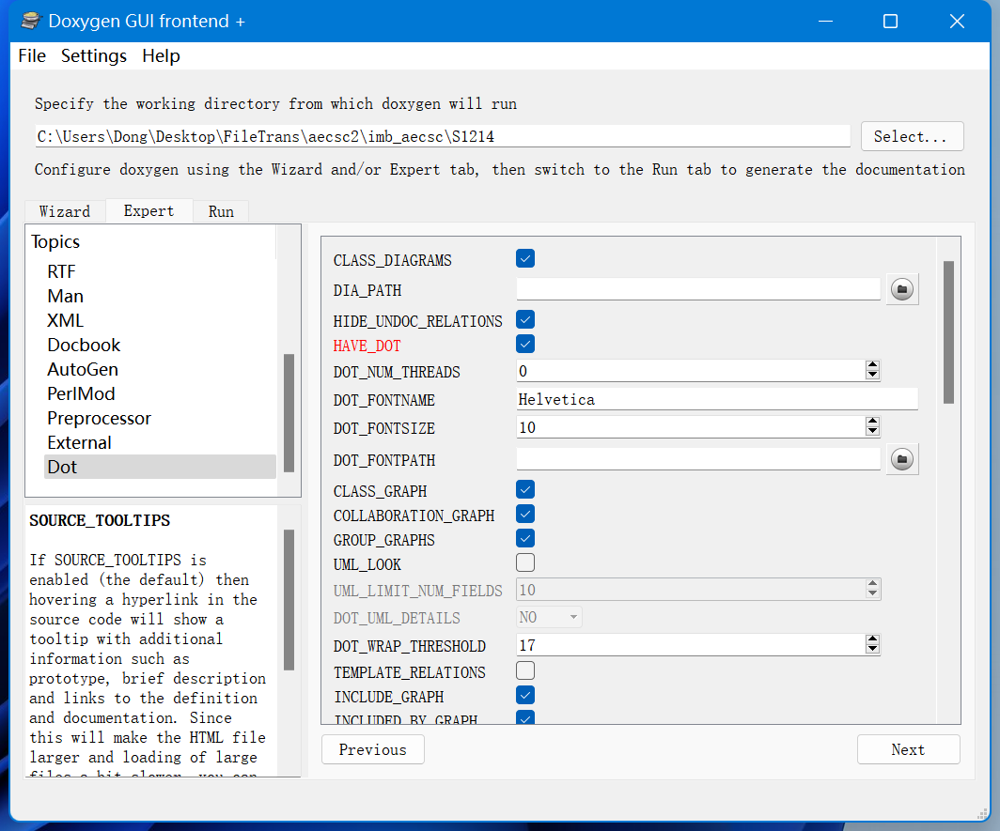

# AECSC-IBM注释规范


# AECSC-IBM 注释规范 Ver.1

## 1. 注释规范说明

* 注释符： `!>`

(`For Fortran "!>" or "!<" starts a comment and "!!" or "!>" can be used to continue an one line comment into a multi-line comment.`)

* 文件开头注释内容

| 文件注释     | 意义   |
| -------- | ------ |
| **@file** | **文件名**(建议有) |
| **@author** | **作者名**(建议有) |
| @email   | 邮箱地址(可无) |
| @version | 文件版本(可无) |
| **@date** | **修改日期**(建议有) |
| **@brief** | **对文件功能的简介**(建议有) |

* 函数与子程序开头注释内容

| 文件注释     | 意义   |
| -------- | ------ |
| **@brief** | **对函数或子程序功能的简介** |
| **@param[in]** | **参数**(输入) |
| **@param[out]** | **参数**(输出) |

### 示例

下面是一个注释过的Fortran文件与子程序的例子:

```fortran
!> @file 文件名
!> @author 作者名
!> @email 邮箱地址(可无)
!> @version 文件版本(可无)
!> @date 2021-12-20(修改日期)
!> @brief 对文件功能的简介

        '文件内容(不包括函数定义部分)'

!> @brief Normal vector solver subroutine(对函数或子程序功能的简介)
!> @param[in]  I,J,K: Grid Location
!> @param[out]  nx,ny,nz: Normal vector
!> @param[out]  mark: identification for points located inside the fluid, 
!> flow-solid boundary, solid zone
        SUBROUTINE imb_norm(I,J,K,nx,ny,nz,mark)
           use arrays,only :jo,ko, &
                      imbnx,imbny,imbnz,imbmark
           use global,only : calcu_norm
           integer i,j,k,ijk,mark
           real nx,ny,nz
           ijk = i+jo(j)+ko(k)
           mark = imbmark(ijk)
           if(calcu_norm.ne.0)then
           nx = imbnx(ijk)
           ny = imbny(ijk)
           nz = imbnz(ijk)
           else
           nx = 0
           ny = 0
           nz = 0
           endif
           return
        END
```

* Doxygen文档中该文件效果


* Doxygen文档中该Subroutine效果


## 2. 修改版本说明

* 建议使用*Markdown*编写文档 `.../SRC/软件名.软件版本.md` ，例如`imb.ver1211.md`:

```markdown
# imb.ver1211

  Compared to imb.ver.1125
## output.F statistics.F

  * Calculate flout_stat and floin_stat

## imb.F90

  * Correction for imb_f_crn, ijk... ---> imbflag(ijk...) 
  * Check F(ijk+nfo(nvu,nvv,nvw)) after CGSTAB for imbflag of ijknn,ijkss,...
  * Correction for COEF and nv

## check_rate.F

  * Set virtual_rate by flout_stat/floin_stat * rate

## boundary3.F

  * Reset boundary F(ijk+nfo(nvu,nvv,nvw)) value by floin/flout * F
```

* Doxygen文档中Markdown文档的效果


## 附: Doxygen文档生成使用简介(Fortran)

1. 下载安装[Doxygen](https://www.doxygen.nl/download.html)。

2. 下载安装[graphviz](http://www.graphviz.org/download/)，用于生成调用关系图。
3. 使用Doxywizard(包含于Doxygen)生成技术文档：





